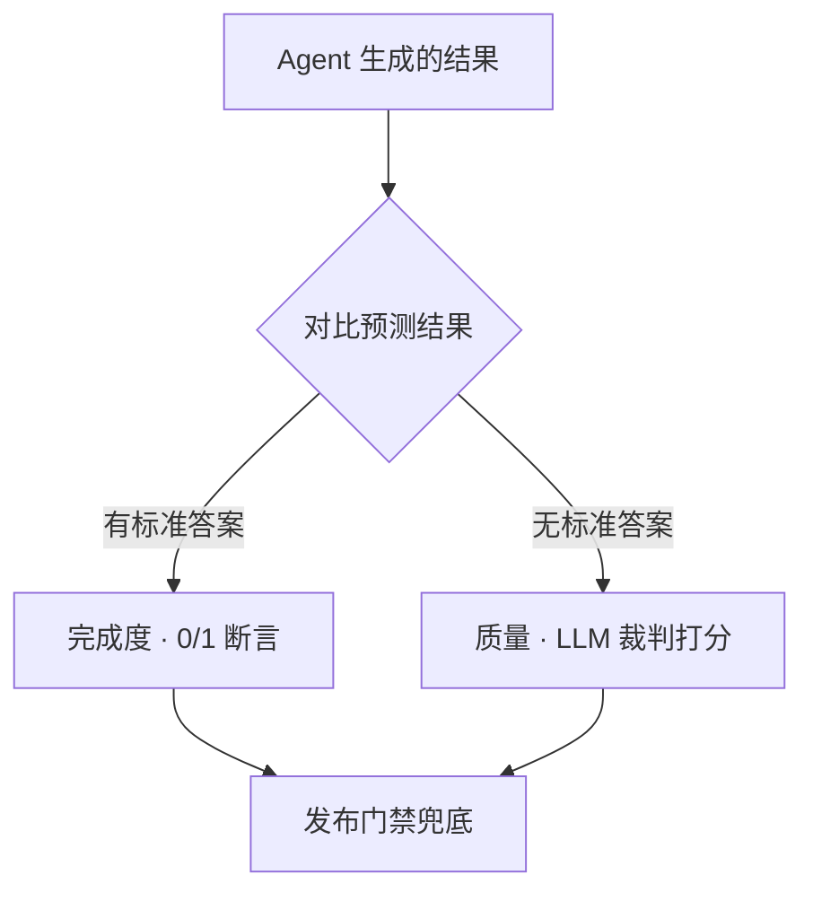
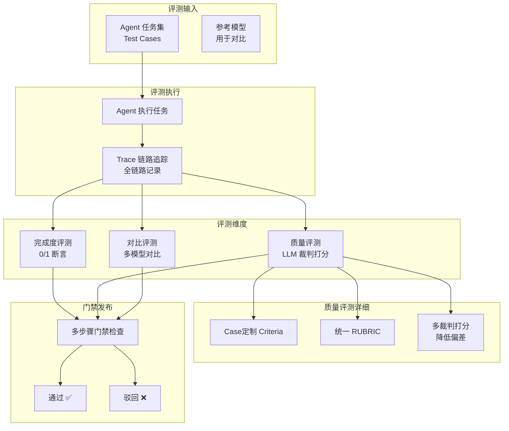
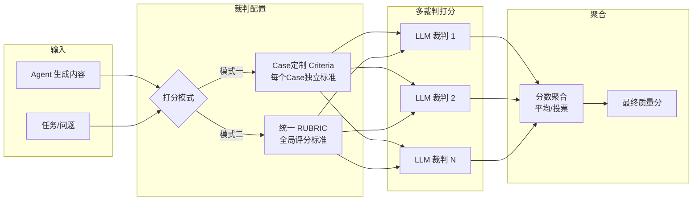
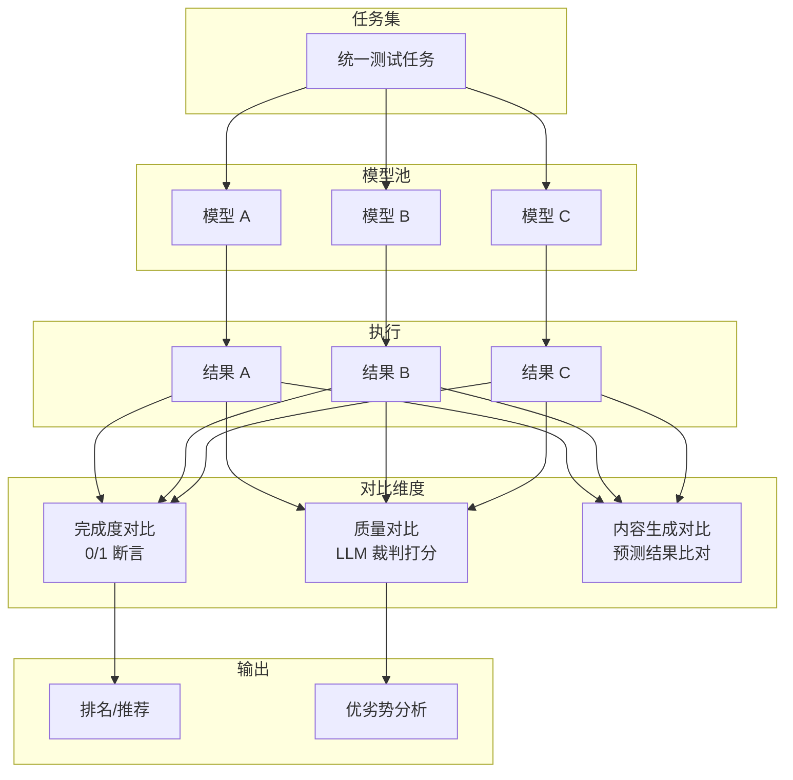
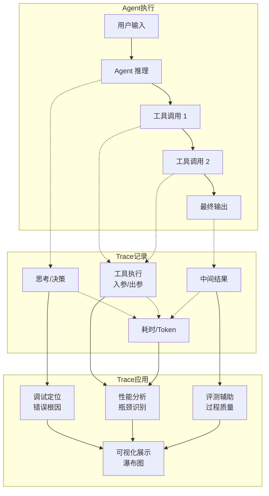
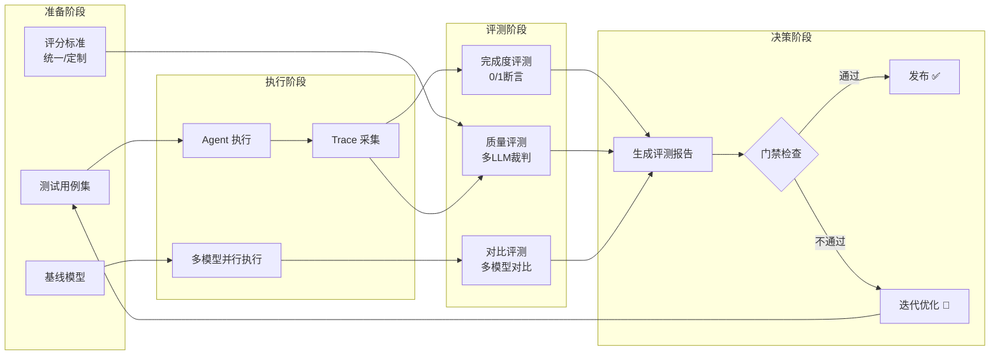

# waku-agent —— 个人理解版 中文参考

> 本地优先的个人 Agent。下面是我读源码 + 动手实验后，对核心机制的理解整理。侧重「怎么测一个 Agent」这条主线。

四大支柱：**Harness · Loop · Memory · Eval/LLM-Ops**，没有框架把关键藏起来。

---
飞书参考文档: https://acnewhslidyx.feishu.cn/wiki/RRqZwqdxtiheYwkLnvLcZrO9nfb?from=from_copylink
---

## 致谢

本代码是对 [waku-agent](https://github.com/shenseanchen/waku-agent) 源码的学习与二次整理。
感谢原作者 [ShenSeanChen](https://github.com/shenseanchen) 开源项目。
感谢 UP 主 [AI_Julie](https://github.com/juliepy/AI-Engineer-from-scrach) 的讲解与指引。

## 我关注的核心主题

| # | 主题 | 关键文件                                                         |
|---|------|--------------------------------------------------------------|
| 1 | Web 端测试 | `waku/gateway/fastapi_gateway.py`                            |
| 2 | OpenAI ↔ Anthropic 输出格式转换 | `waku/loop/models.py`                                        |
| 3 | Memory 记忆 | `waku/memory/`                                               |
| 4 | Agent Trace 全链路追踪 | `waku/ops/tracing.py`                                        |
| 5 | MCP 连接器与技能转换 | `waku/tools/mcp_client.py` · `memory/procedural/`            |
| 6 | Agent 测评方式（重点） | `waku/ops/scoring.py` · `judge.py` · `evals/` · `demo_..py/` |
| 7 | 发布门禁（多步骤兜底） | `waku/ops/release_gate.py`                                   |

---

## 值得借鉴的设计决策
- 检索之前的门禁（不是每轮都检索）：用小模型做裁判，回答「这条消息需要用到用户的记忆吗？」——省延迟，更重要的是避免无关记忆带偏答案。
- 记忆整合是批量的（「每 N 轮之后」），与回复路径异步，且不会丢数据：如果摘要器失败，聊天日志保持未整合状态。
- 确定性评测和 judge 评测永不混用。 一个是单元测试，另一个是带分数的观点。发布门禁要求前者 100% 通过、后者达到阈值。
- 每一层都有朴素的默认实现和一个有文档的升级路径。 FTS5 → pgvector、mock 日历 → Google Calendar、JSONL → Phoenix/Langfuse。默认实现永远零注册即可用。

## 1. Web 端测试 —— fastapi_gateway.py

不用原始 dashboard.py，写一个最小可用的 FastAPI 网关，复刻 CLI 的「构建 Waku → 收消息 → 跑完整循环 → 返回回复」，只是 I/O 换成 HTTP。

```text
cli.py                    fastapi_gateway.py
Waku()                    懒加载构建
waku.respond(msg)         POST /chat → respond(msg, source="web")
print(reply)              JSON 返回 {reply, tool_calls, iterations}
```

- 非流式：一次跑完整轮再返回
- 前端是内联的简单 HTML（输入框 + fetch）
- 用于功能测试：发消息看 Waku 跑完整循环

```powershell
pip install fastapi uvicorn
python -m waku.gateway.fastapi_gateway    # http://127.0.0.1:8000
```


消息会话记忆为N轮次，可进行上下文压缩等改进

改进：多用户session\_id隔离

run\_loop的messages和chat\_log：前者为内存里的临时列表，后者磁盘数据库

messages\.append修改临时列表让LLM在内循环看到assistant的思考（工具结果），跑完一轮后临时列表丢弃，不写入数据库，只有chat\_log入库user\-assistant一轮问答


---

## 2. 精简 Dashboard —— dashboard-study.py

原始 `dashboard.py` 有 1609 行（40 个函数 + HTTP Handler + main）。为了研究「多模型对比」这块逻辑，把 Compare 部分单独剥出来，只留 7 个函数 + 定价。

| 保留 | 删掉 |
|------|------|
| `_compare_one` / `compare_models` / `compare_stream` | chat / collect / settings / 会话管理 |
| `compare_clear` / `_compare_history_response` / `compare_regrade` / `compare_delete_run` | SQL console / 语音转写 / 模型目录 |
| `price_for` + `PRICING` / `MODEL_PRICING` | `Handler` 类 + `main()`（HTTP 样板） |

它是**纯业务逻辑函数库**（没有服务器、不能 `python -m` 跑），供研究 Compare 数据流或迁移 FastAPI 时参考。

---

## 3. OpenAI ↔ Anthropic 输出格式转换

主循环只说一种「方言」：**Anthropic Messages 形状**。其他格式在边界翻译掉。

```text
主循环（内部）           Anthropic Messages 格式
   │
   ├─ anthropic 线 provider ── 直接返回 anthropic.Anthropic（零翻译）
   └─ openai 线 provider ──── OpenAICompatClient 双向翻译
```

| 维度 | Anthropic Messages（内部） | OpenAI chat.completions（对外） |
|------|---------------------------|--------------------------------|
| system | 独立参数 `system` | `role="system"` 的消息 |
| content | block 列表（text / tool_use / tool_result） | 字符串 / `tool_calls` 数组 |
| 工具结果 | `tool_result` block | `role="tool"` 消息 |

关键：`get_client()` 返回的东西，无论 provider 是谁，都有 `.messages.create()` / `.messages.stream()`，所以循环代码完全不用关心底层是哪家 API。

---

## 4. Memory 记忆

三支柱 + 两道工序。一个 SQLite 文件（`.waku/state.db`）装下全部。

| 层 | 作用 |
|----|------|
| Semantic（语义） | 持久事实，`facts` 表 + FTS5 |
| Episodic（情景） | 带日期的事件，`episodes` 表 |
| Procedural（程序性） | SKILL.md 怎么做（存文件，不进 db） |
| Retrieval gate（检索门禁） | 每轮先问「这轮要不要检索记忆？」 |
| Consolidation（记忆整合） | 每 N 轮把聊天蒸馏成事实 |

核心：**工作记忆是滑动窗口（RAM），chat_log 是完整存档（磁盘）**。切换会话只动前者，后者全程在写。SOUL.md 每轮重读（人设），改了下一轮就生效。

---

## 5. Agent Trace 全链路追踪

每轮对话把「按顺序发生了什么」追加成 JSONL，零依赖。

```text
.waku/traces/<date>.jsonl     ← 追踪轨迹（可重置）
.waku/usage.jsonl             ← 花费台账（永不清除）

turn_start → gate → llm → tool → llm → turn_end
```

- `Tracer` 兼作循环的观察者，每个事件盖时间戳写一行
- 同一个事件流，设置了 OTel endpoint 就变成 span 树（Phoenix 瀑布）
- 两个查看器：`python -m waku.ops.show_trace`（终端时间线）、`python -m waku.ops.trace_viewer`（浏览器瀑布）

---

## 6. MCP 连接器与技能转换

- **MCP**：`.waku/mcp.json` 配置外部服务器，`mcp_client.py` 把它们的工具拉进同一个注册表（延迟导入，没配 MCP 零开销）
- **技能（程序性记忆）**：SKILL.md 是「怎么做事」的指令，`loader.py` 用关键词重叠做透明触发，`create_skill` 工具让 Agent 自己写技能

---

## 7. Agent 测评方式（重点）

**两类测评，永不混用。**



### 7.1 完成度 —— 0/1 断言（不需要 LLM）

「任务做成了没」：Agent 生成的动作 vs 预测结果（`expect_tool` / `expect_in_args` / `expect_min_tool_calls`）逐项对比。

```json
{"input": "Schedule a coffee with Alex...", "expect_tool": "create_event", "expect_in_args": {"title": "alex", "start": "T09:00"}}
```

- **离线**：`ScriptedClient` 假模型回放，不花钱，测自己的代码
- **live**：真实模型跑 `dataset.jsonl`，测模型+提示词行为
- 判定就是 `scoring.check_case` 的 5 步硬规则

### 7.2 质量 —— LLM 裁判打分（不需要标准答案）

「回复好不好」：开放式问题没有唯一答案，所以**不需要预先知道答案**，只需要预先写一句**评分标准（criteria）**，让 LLM 照着打 0-10 分（阈值 6）。

```python
# 每个 case 定制 criteria prompt
criteria = "uses the remembered fact that Alex prefers morning meetings"
```

关键区别：0/1 断言是「拿标准答案对答案」，LLM 裁判是「拿一把打分尺子量好坏」。

### 7.3 多模型对比 —— 模型评测

同一条任务，N 个模型各跑一遍（隔离沙箱 + 完整 agent 循环），并排对比四个维度：

| 维度 | 怎么量 |
|------|--------|
| 速度 | `latency_ms` |
| 成本 | token × 单价 `price_for` |
| 完成度 | `check_case` 0/1 |
| 质量 | 裁判 `judge_reply` 0-10 |

---

## 8. 发布门禁 release_gate（多步骤兜底）

```
第 1 步：deterministic 必须 100% 全绿（硬门，任一失败 → GATE CLOSED）
第 2 步：有 key 才跑 judge，要过阈值 6（软门）
全过 → GATE OPEN（退出码 0 = 可以发布）
```

```powershell
python -m waku.ops.release_gate    # 或 make gate
```

结果写 `.waku/eval_report.json`（最新）+ `.waku/eval_runs.jsonl`（历史），Dashboard Ops 页读它。

---

## 9. 我的实操 Demo

| Demo | 演示什么 |
|------|----------|
| `demo_live_eval.py` | 0/1 断言：真实模型跑 dataset，看工具调对没 |
| `demo_judge_eval.py` | LLM 打分（evals 版）：自定义 criteria |
| `demo_judge_eval_2.py` | LLM 打分（ops/judge.py 版）：固定 RUBRIC + tools |
| `demo_compare_eval.py` | 多模型对比：同题竞技，四维打分 |
| `demo_judge_eval.py --all` | 跑全部 judge case |

```powershell
python demo_live_eval.py            # 0/1 断言
python demo_judge_eval.py           # 质量打分
python demo_compare_eval.py         # 多模型对比
```

---

Agent评测是一个涵盖执行追踪、质量评估与发布控制的完整闭环体系。
评测流程首先从测试任务集出发，驱动Agent执行特定任务，同时全程采集Trace链路追踪数据，记录Agent的每一次推理、工具调用、中间结果及耗时Token消耗，为后续问题定位与性能分析提供依据。
在质量评估层面，评测体系采用多维度的打分机制。完成度评测采用0/1断言方式，判定Agent是否成功完成任务目标。质量评测则引入LLM作为裁判进行打分，该方式无需标准答案，可支持多裁判并行打分以降低单一模型偏差。
质量评测支持两种评分模式：一是为每个测试用例定制独立的评分标准（Case定制Criteria），二是采用统一的评分量规（统一RUBRIC）对所有任务进行一致性评估。对比评测维度支持多个模型在相同任务集上的横向对比，并可额外引入LLM质量打分，综合评估不同模型的优劣。
此外，对于Agent内容生成类任务，还可将生成结果与预测结果进行比对，交由单一LLM或多LLM协同打分。
评测完成后，所有维度的结果将汇总为评测报告，并进入多步骤门禁发布流程。门禁依次检查完成度是否达标、质量分是否超过阈值、新模型是否优于基线模型、Trace链路是否存在异常超时，最后经人工审批确认。
任一环节未通过则驳回并反馈修复，全部通过后方可正式发布，形成“评测—门禁—迭代”的完整闭环。









