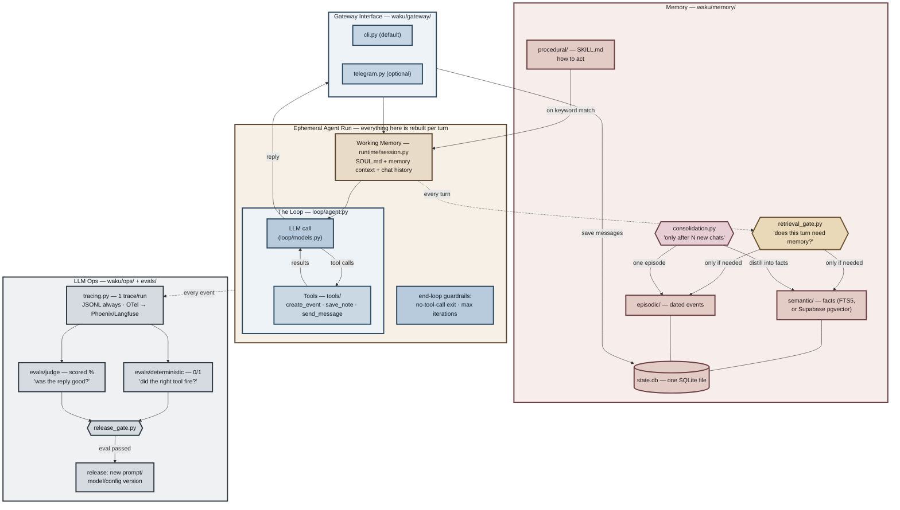

# 架构——白板，更新版

与之前视频里两张白板图（通用 Harness/Loop/Memory/LLM-Ops 那张和 Hermes 专有的那张）是同一套系统，现在每个方框都带上了文件路径。

## 值得借鉴的设计决策

- **检索之前的门禁**（不是每轮都检索）：用小模型做裁判，回答「这条消息需要用到用户的记忆吗？」——省延迟，更重要的是避免无关记忆带偏答案。
- **记忆整合是批量的**（「每 N 轮之后」），与回复路径异步，且不会丢数据：如果摘要器失败，聊天日志保持未整合状态。
- **确定性评测和 judge 评测永不混用。** 一个是单元测试，另一个是带分数的观点。发布门禁要求前者 100% 通过、后者达到阈值。
- **每一层都有朴素的默认实现和一个有文档的升级路径**——FTS5 → pgvector、mock 日历 → Google Calendar、JSONL → Phoenix/Langfuse。默认实现永远零注册即可用。

## 这刻意不是什么

不是框架，不是多 agent，不是生产环境。它是可读的蓝图——OpenClaw 和 Hermes 是产品；这份文档是一个下午就能读完、解释它们的读物。
