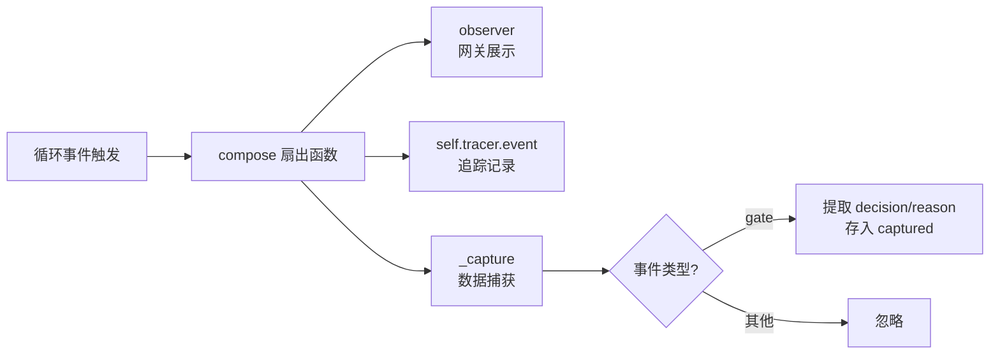
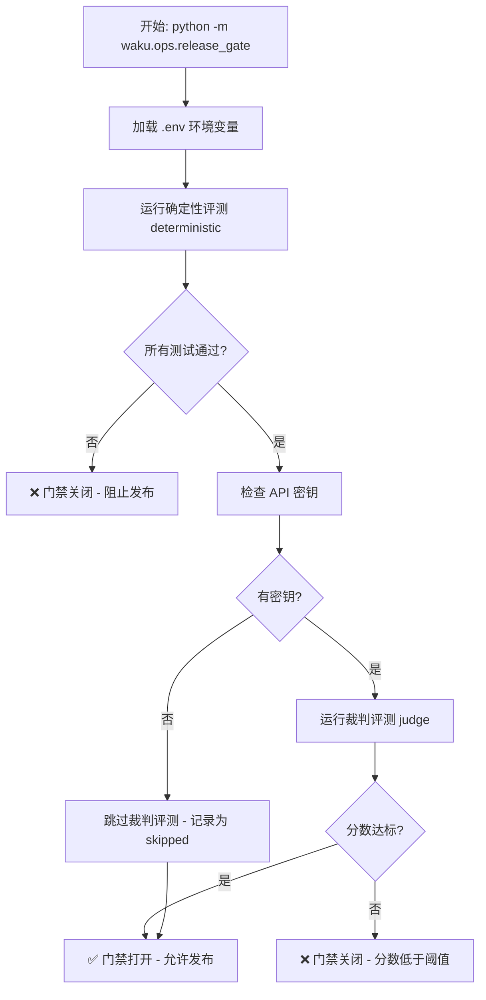
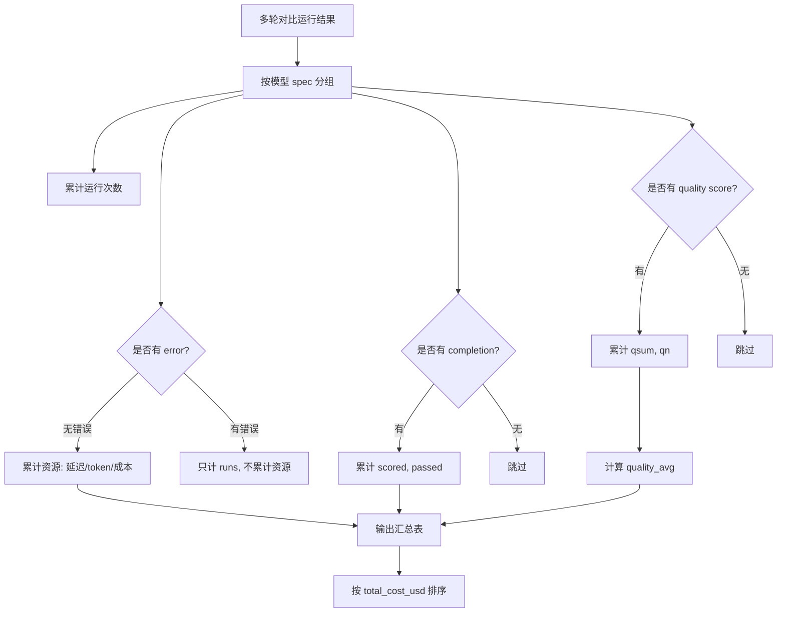
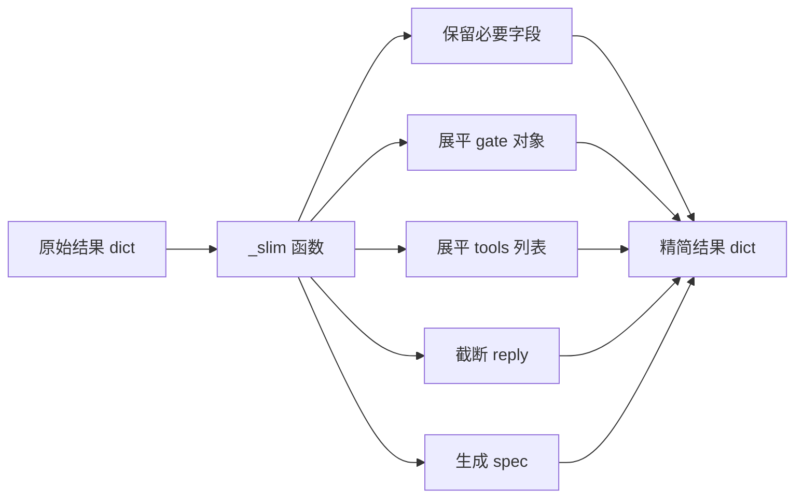
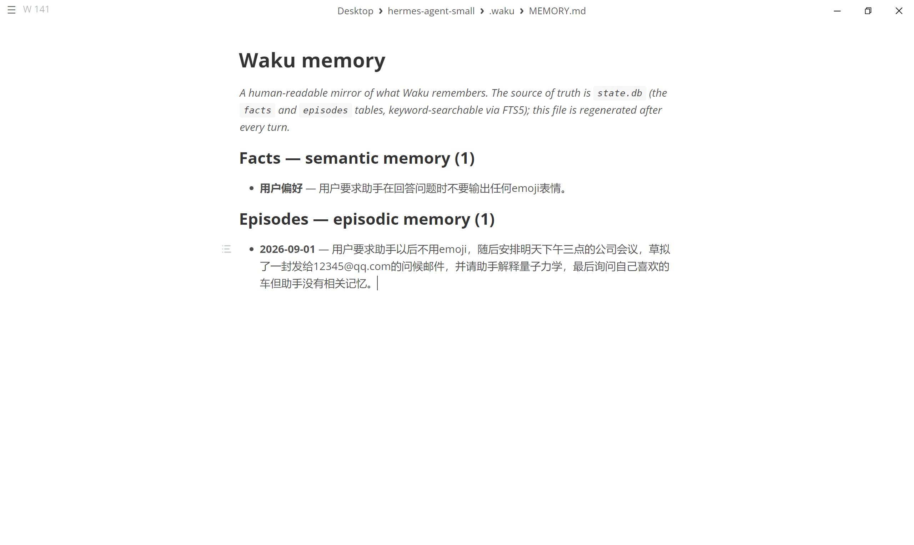
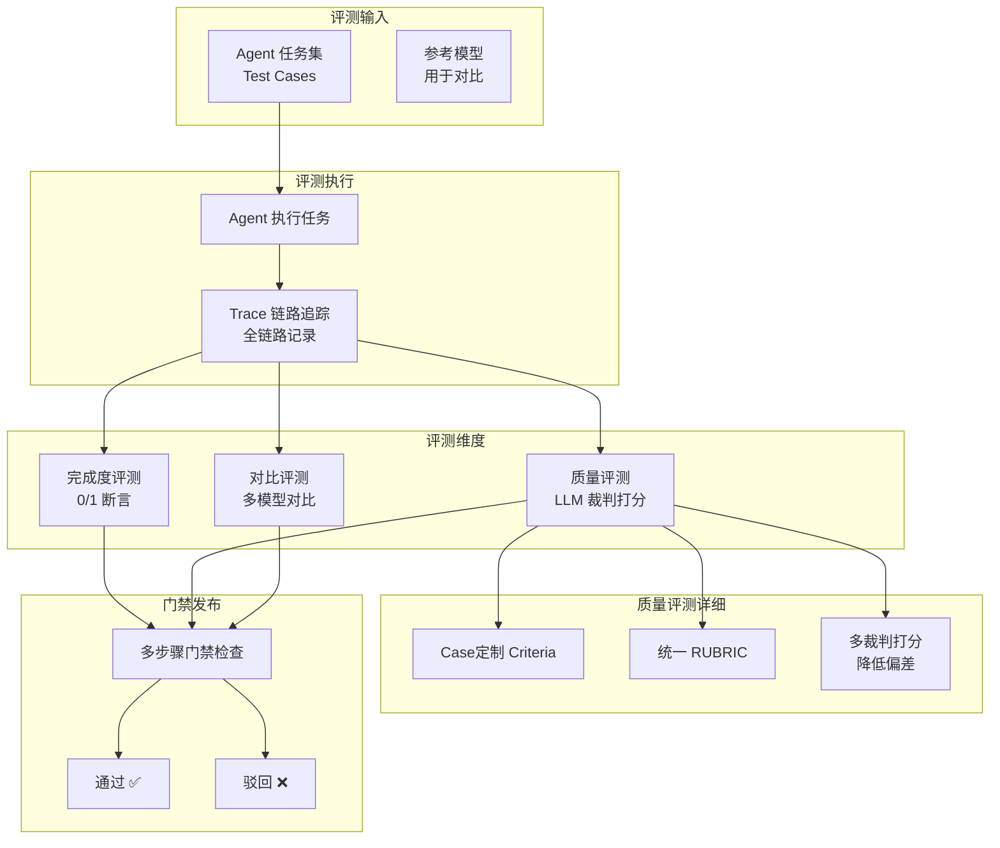
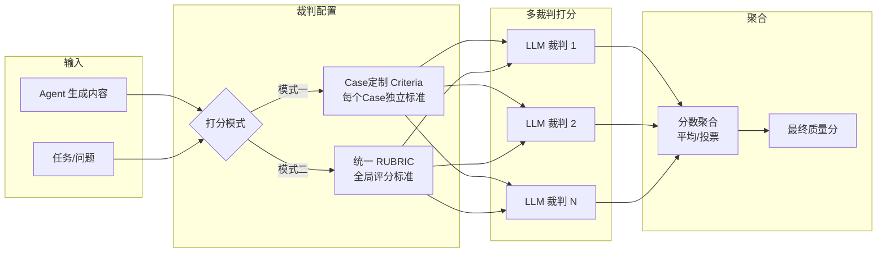
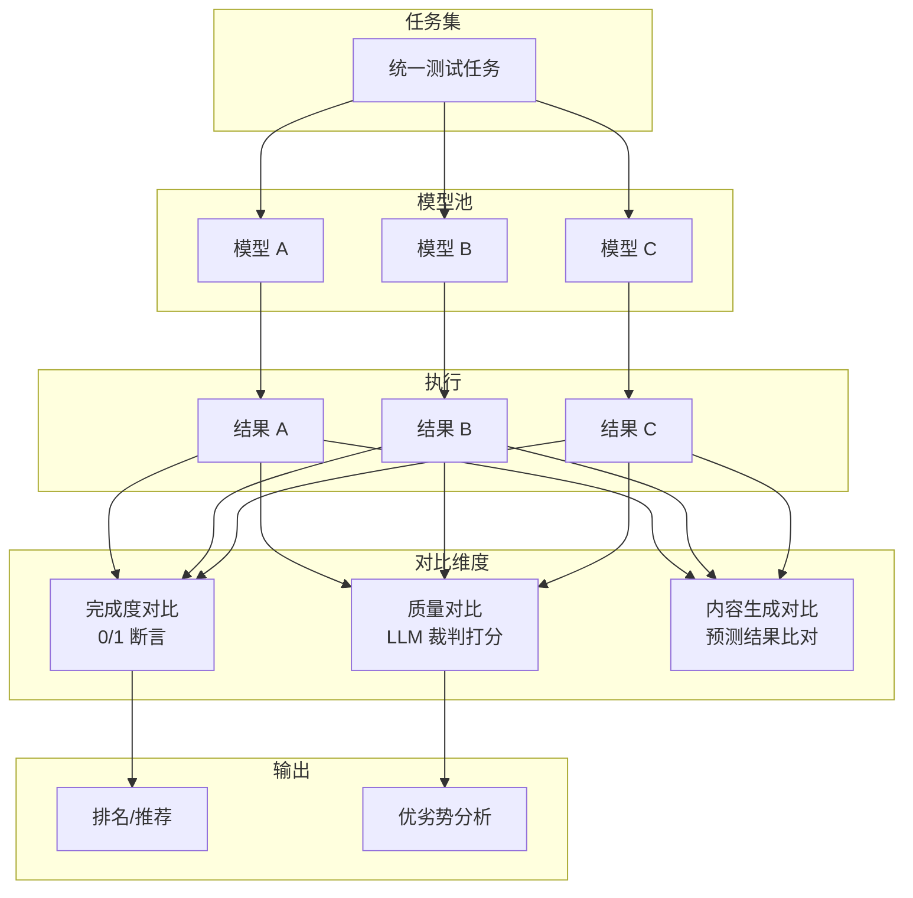
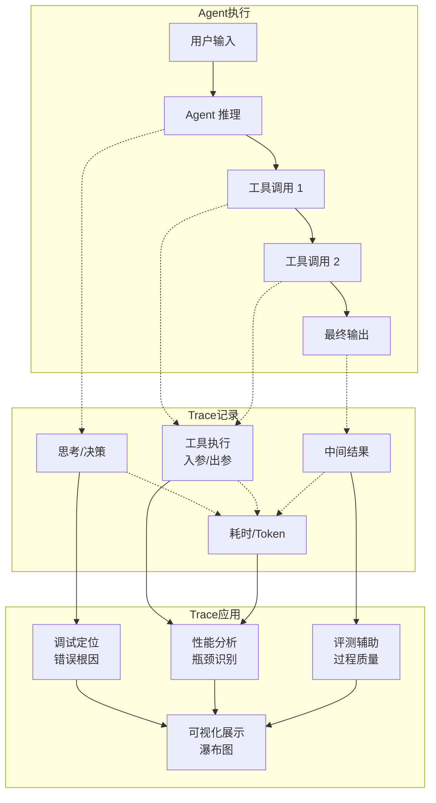
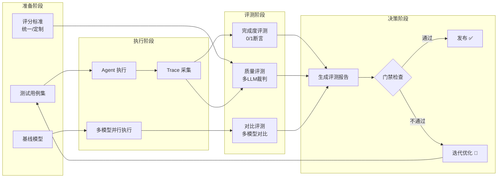

# waku\-hermes\-agent\-small

**四大结构：Harness · Loop · Memory · Eval/LLM\-Ops**


waku/**init**\.py  →  waku/app\.py  →  waku/loop/agent\.py  →  waku/runtime/session\.py  →  waku/memory/retrieval\_gate\.py  →  waku/ops/release\_gate\.py


## waku/config\.py

```Python
provider: LLM provider
 api_key：
 base_url：
 model：
 small_model：检索门禁和记忆整合摘要器使用的廉价模型
 home：存放状态的位置 ./.waku
 max_iterations：循环护栏：推理-行动循环上限
 max_tokens：单次输出上限
 history_turns：工作记忆窗口轮数 只有最近 N 轮进入提示词
 --- 记忆
 consolidate_every：整合触发间隔 每累积 N 次新交流后执行一次整合（把聊天提炼成持久事实）
 retrieval_top_k：检索返回条数上限
 semantic_store：语义记忆后端
 episodic_store：情境记忆后端
 --- 工具
 apple_calendar：
 apple_tools：
 experimental：实验性工具开关
 --- 可选网关
 telegram_token：为空则不启用Telegram
 --- 追踪
 otel_endpoint：OpenTelemetry导出端点 留空则只写JSONL
 ensure_home：建出状态目录树
     .waku/
     .waku/traces
     .waku/outbox
 load_setting：拼出全部配置 return Settings()
```

## waku/db\.py

一个SQLite文件（state\.db）装下全部状态

4张业务表：3张配置FTS5全文检索索引\+同步触发器

```SQL
id 自增主键
title 事件标题
start 开始事件
end 结束事件
attendees 与会者，逗号分隔
notes 备注
created_at
```

```SQL
id 主键
subject 事实所指人/物
content 事实本身
source 'user'用户直接告知 或 'consolidation'整合得出
created_at
```

```SQL
id 主键
happened_at 事件发生时间
summary 事件摘要
created_at
```

```SQL
id 主键
role "user" / "assistant"
content 消息内容
consolidated 是否已被整合提炼（默认0）
session_id 所属会话线程（默认default）
source 来自哪个网关（_migrate后加的列）
meta 每轮遥测JSON：门禁决策 延迟 迭代次数 工具（_migreate后加的列）
created_at
```

\_migrate\(conn: sqlite3\.Connection\) \-\> None：对 SQLite 数据库中的 `chat_log` 表进行增量式、幂等的列升级（即添加新列），确保旧数据库能平滑迁移到新版本

1. 提取列名集合

2. 补上session\_id, source, meta三列

connect\(home: Path, check\_same\_thread: bool = True\) \-\> sqlite3\.Connection：

- `check_same_thread` 参数：控制是否允许多线程共用连接

    - `True`（默认）：只允许创建连接的线程使用（SQLite 默认线程安全模式）

    - `False`：允许跨线程使用，配合锁保护（为了支持 dashboard 的多线程 HTTP 服务）

- conn\.row\_factory = sqlite3\.Row

    - 查询返回的行可以按列名访问：`row["session_id"]` 或 `row["source"]`

    - 而不是元组下标：`row[0]`、`row[1]`（代码可读性更好）

- conn\.execute\("PRAGMA busy\_timeout=3000"\)

    - 当数据库被其他连接锁定时，等待最多 3000 毫秒（3 秒）

    - 避免立即抛出 `database is locked` 错误

    - 场景：聊天写入时，dashboard 同时读取，可能发生写锁冲突

- 一次性执行全部建库语句

- 老库补充缺失列

- return conn

```SQL
-- 语义记忆：关于你、你的人、你的项目的持久事实。
CREATE TABLE IF NOT EXISTS facts (
    id INTEGER PRIMARY KEY,
    subject TEXT NOT NULL,         -- 事实所指的人/物，如 'alex'
    content TEXT NOT NULL,         -- 事实本身
    source TEXT DEFAULT 'user',    -- 'user'（直接告知）或 'consolidation'（整合得出）
    created_at TEXT DEFAULT (datetime('now'))
);
CREATE VIRTUAL TABLE IF NOT EXISTS facts_fts USING fts5(
    subject,           -- 索引 subject 列
    content,           -- 索引 content 列（核心搜索目标）
    content=facts,     -- 告诉 FTS：数据实际存在 facts 表中
    content_rowid=id   -- 告诉 FTS：facts 表的主键是 id
);
-- 触发器：facts 新增一行时，同步把它的 subject/content 写进全文索引（保证可检索）
CREATE TRIGGER IF NOT EXISTS facts_ai AFTER INSERT ON facts BEGIN
    INSERT INTO facts_fts(rowid, subject, content) VALUES (new.id, new.subject, new.content);
END;
-- 触发器：facts 删除一行时，从全文索引删掉对应行（'delete' 是 fts5 的特殊删除标记）
CREATE TRIGGER IF NOT EXISTS facts_ad AFTER DELETE ON facts BEGIN
    INSERT INTO facts_fts(facts_fts, rowid, subject, content) VALUES ('delete', old.id, old.subject, old.content);
END;
-- 触发器：facts 更新一行时，先删旧索引再插新索引（保证索引与主表永远一致）
CREATE TRIGGER IF NOT EXISTS facts_au AFTER UPDATE ON facts BEGIN
    INSERT INTO facts_fts(facts_fts, rowid, subject, content) VALUES ('delete', old.id, old.subject, old.content);
    INSERT INTO facts_fts(rowid, subject, content) VALUES (new.id, new.subject, new.content);
END;
```

## waku/app\.py

装配：把各个部件组装成一个 Waku。网关调用 \`respond\(\)\`。
装配图：config → db → tools → memory → session → loop。

```Python
__init__:
    settings配置
    建立home目录
    初始化数据库连接conn
    初始化LLM客户端client
    初始化memory = Memory(conn, settings, client)
    tools工具（依赖记忆 所以后建）= build_registry(conn, settings, memory)
    mcp_bridge = getattr(self.tools, "mcp_bridge", None) MCP桥
    tracer = Tracer(settings) 追踪器 记录每轮LLM事件

close(self): 释放外部资源（MCP 子进程）。在 dashboard 因设置变更而重建 agent 时调用
respond(self, user_message: str, observer: Observer | None = None,
    source: str = "cli", stream: bool = False) -> LoopResult:
    一整轮：组装工作记忆 跑循环 持久化
```


## waku/loop/models\.py

**模型接入**

```Python
kind：anthropic / openai
ken_env：key存在哪个环境变量里
base_url：
model：默认主模型（循环用）
small_model：默认廉价模型（检索门禁+记忆整合用）
catalog_url：str 模型列表查询地址
聊天端点：https://api.moonshot.cn/v1/chat/completions（OpenAI 线格式）
模型目录：https://api.moonshot.cn/v1/models（OpenAI 兼容）
flagship：UI展示用的双模型 为空退回model
fast：UI展示用的双模型 为空退回small_model
default_pair(self) -> list[str]: [flagship, fast]，去重，切换器的默认选项
```

```Python
PROVIDERS: dict[str, Provider]

"anthropic": Provider("anthropic", "ANTHROPIC_API_KEY", None,
                      "claude-sonnet-5", "claude-haiku-4-5-20251001",
                      catalog_url="https://api.anthropic.com/v1/models",
                      flagship="claude-opus-4-8", fast="claude-sonnet-5")

"openai":    Provider("openai", "OPENAI_API_KEY", None,
                      "gpt-5.3-chat-latest", "gpt-4.1-mini",
                      catalog_url="https://api.openai.com/v1/models"),
                      
"deepseek":  Provider("openai", "DEEPSEEK_API_KEY", "https://api.deepseek.com",
                      "deepseek-v4-pro", "deepseek-v4-pro"),
                      
"kimi":      Provider("anthropic", "MOONSHOT_API_KEY", "https://api.moonshot.ai/anthropic",
                      "kimi-k3", "kimi-k2.6",
                      catalog_url="https://api.moonshot.ai/v1/models",
                      flagship="kimi-k3", fast="kimi-k2.7-code-highspeed"),
```


get\_client\(settings: Settings\) \-\> OpenAICompatClient\(api\_key=api\_key, base\_url=base\_url, timeout=timeout\)

```Python
获取Provider：PROVIDERS.get(settings.provider)
获取api_key：api_key.encode("latin-1") 提前校验 全是ASCII字符
获取model：
获取small_model：
获取base_url：
配置超时：timeout = float(os.getenv("WAKU_LLM_TIMEOUT", "120"))
分类：
    kind = "anthropic"
    kwargs = {"api_key":api_key, "timeout":timeout, "base_url":base_url}
    return anthropic.Anthropic(**kwargs)
    
    kind = "openai"
    return OpenAICompatClient(api_key=api_key, base_url=base_url, timeout=timeout)
```


```Python
循环中使用的是Anthropic Messages的请求格式
如果底层调用的是OpenAI风格的chat.completions API 则需要转换

__init__:
    OpenAI LLM客户端：_client = openai.OpenAI(api_key=api_key, base_url=base_url, timeout=timeout)
    self.messages = SimpleNamespace(create=self._create, stream=self._stream)
SimpleNamespace(create=self._create, stream=self._stream)
把两个方法挂到 .create / .stream 属性名上：                                                                                                                                                                                                                                                                     
  client.messages.create(...) 实际上就是调 self._create(...)
  client.messages.stream(...) 实际上就是调 self._stream(...)
```

client\.messages\.create\(model, messages, max\_tokens, system, tools\)

```Python
response = self._call(self._to_openai(
    model=model, messages=messages, max_tokens=max_tokens, system=system, tools=tools))
```

anthropic参数转换为openai参数

```Python
1. 将anthropic的入参消息翻译成OpenAI chat.completions的参数
oai_messages = []
oai_messages.append({"role": "system", "content": system})
for message in messages:
    content = message["content"]
    纯文本消息：
        oai_messages.append({"role": message["role"], "content": message["content"]})
    角色为assistant：
        遍历content数组，取出type=="text"的块并拼接为text
        calls = [] 遍历content数组，取出type=="tool_use"
            组装call：call = {"id": b.id, "type": "function", "function": {"name": b.name, "arguments": json.dumps(b.input)}}
                extra = getattr(b, "extra", None) call["extra_content"] = extra
            calls.append(call)
        组装这一条assistant消息：entry["role","context","tool_calls"]
        oai_messages.append(entry)
    tool_results blocks 的每条tool消息：
        遍历content数组，取出tool_result：and block is dict
        oai_messages.append({"role": "tool", "tool_call_id": block["tool_use_id"], "content": block["content"]})
---
2. 组装kwargs：dict = {"model": model, "messages": oai_messages, "max_completion_tokens": max_tokens}
3. 将anthropic的工具schema转成OpenAI的tools参数
    kwargs["tools"] = [  # 把 anthropic 形状的工具 schema 转成 OpenAI 的 tools 参数
        {"type": "function",
         "function": {"name": t["name"], "description": t["description"],
                      "parameters": t["input_schema"]}}
        for t in tools
    ]
return kwargs
```

执行openai的api

```Python
执行chat.completions.create
老一点的 OpenAI 兼容端点只认 max_tokens，不认较新的 max_completion_tokens
return self._client.chat.completions.create(**kwargs, **extra)


# 正常调用（所有参数都在 kwargs 里）
_call(kwargs={"model": "gpt-4", "messages": [...], "max_tokens": 100})

# 带额外参数调用（temperature、top_p 等）
_call(
    kwargs={"model": "gpt-4", "messages": [...], "max_tokens": 100},
    temperature=0.7,
    top_p=0.9,
    stream=True,
    stop=["END"]
)
```

client\.messages\.create\(model, messages, max\_tokens, system, tools\)

```Python
1. 得到openai的response：
    response = self._call(self._to_openai(
        model=model, messages=messages, max_tokens=max_tokens, system=system, tools=tools))
2. 获取choice：choice = response.choices[0].message
3. 组装成anthropic的blocks：
    blocks = []
    if choice.content：blocks.append(SimpleNamespace(type="text", text=choice.content))
    工具调用：for call in choice.tool_calls or []：
        blocks.append(SimpleNamespace(type="tool_use",
            id=call.id, name=call.function.name,
            input=json.loads(call.function.arguments or "{}"),
            extra=getattr(call, "extra_content", None)))
    用量信息：usage = getattr(response, "usage", None)

return SimpleNamespace(
    stop_reason="tool_use" if choice.tool_calls else "end_turn",
    usage=SimpleNamespace(
        input_tokens=getattr(usage, "prompt_tokens", 0),
        output_tokens=getattr(usage, "completion_tokens", 0),
    ),
    content=blocks,
)
```


---

Anthropic：client\.messages\.stream\(\) 的上下文管理器：

迭代 \.text\_stream拿到文本增量

用 \.get\_final\_message\(\) 拿到组装好的 Anthropic 形状响应


流式调用：client\.messages\.stream\(model, messages, max\_tokens, system, tools\)

```Python
kwargs = self._to_openai(  # 复用地化翻译，剩下的交给 _OpenAIStream 处理增量
    model=model, messages=messages, max_tokens=max_tokens, system=system, tools=tools)
return _OpenAIStream(self, kwargs) 
```

```Python
__init__(self, client: OpenAICompatClient, kwargs: dict)
    _client = client
    _kwargs = kwargs
    _text: list[str] 积累文本增量
    _tools: dict[int, dict] = {}
    _usage: 用量信息

def text_stream(self)
def get_final_message(self)
```


## waku/runtime/session\.py

**为每一轮组装工作记忆**

```Python
load_soul(settings) -> str:
    SOUL.md 人设文件 首次运行创建 每次运行都重读 return sout_path.read_text()
```

Session：承载一段对话：聊天历史 \+ 系统提示词的组装配方。每个网关连接一个 Session

- build\_system 组装系统提示词

- add\_exchange 记录历史

- start\_new 开启新对话

- switch 切换会话 

```Python
__init__:
    settings
    memory
    session_id：当前会话标签 chat_log行的分组键
    history: list[dict] 本次会话的聊天历史（工作记忆的一部分）每次新建都清空
    
build_system(user_message, notify) -> str:
    组装系统提示词：人设+当前时间+模型信息+（记忆/技能上下文）
    parts = SOUL+时间+模型
    if memory is not None:
        轻量门禁判断要不要检索 默认开启又慢又会带偏回答 memory/retrieval_gate.py
        retrieved = self.memory.gated_retrieve(user_message, notify=notify)
        拼接记忆
        parts.append("\nRelevant memory:\n" + retrieved)
    skills = self.memory.matching_skills(user_message)
    拼接技能
    if skills: parts.append("\nRelevant skill instructions:\n" + skills)
    return str


add_exchange(self, user_message: str, reply: str, tool_calls: list | None = None,
    source: str = "cli", meta: dict | None = None) -> None
    把这一轮记录进历史（工作记忆），如果已接入记忆，也写进聊天日志
    工具活动会被折叠成 assistant 历史条目里的一行紧凑的 [tools used: ...]
    没有它，模型会忘记自己已经行动过，下轮又开心地重跑同一个工具
    record = reply  默认记录就是回复原文
    if tool_calls:  这一轮动过工具：把工具活动折叠进回复
        summary = "; ".join(f"{c['tool']}({c['args']}) -> {c['output']}" for c in tool_calls)
        record = f"{reply}\n[tools used: {summary}]"
    self.history.append({"role": "user", "content": user_message})  用户消息进工作记忆
    self.history.append({"role": "assistant", "content": record})   助手回复（含工具摘要）进工作记忆
    if self.memory is not None: 持久化到聊天日志
        self.memory.log_chat(user_message, record, session_id=self.session_id, source=source, meta=meta)


def start_new(self, session_id: str) -> None
    开启新对话
    会话只是 chat_log 行上的一个标签。新建会话清空工作记忆；切换则重新载入
    self.session_id = session_id  换成新会话的标签
    self.history = [] * 清空工作记忆：新会话从头开始，不带旧上下文*


def switch(self, session_id: str) -> None
    切换会话
    self.session_id = session_id
    self.history = [] 清空历史
    回放最近N轮
    turns = self.settings.history_turns
    for user_msg, reply in list(self.memory.session_history(session_id))[-turns:]:
        self.history.append({"role": "user", "content": user_msg})
        self.history.append({"role": "assistant", "content": reply})

```


## waku/memory/retrieval\_gate\.py

**决定是否要检索记忆的门禁**

`在触碰任何存储之前，一个便宜快速的小模型先回答：这条消息需要用到用户记忆吗？`

`与evals里的LLM-as-judge的裁判模式相同：一个小模型做出一个单一的窄决策`

```Python
GATE_PROMPT：门禁提示词 让模型判断这条用户消息是否需要检索用户的长期记忆，并输出纯 JSON 的检索决策

should_retrieve(
    client: anthropic.Anthropic,
    small_model: str,
    message: str,
) -> tuple[bool, str, str]
    提取纯文本回复
    解析JSON数据
    return (bool, message, reason)
```


## waku/memory/semantic/supabase\_store\.py

**语义记忆存储：写入提取出的事实（向量版本）**

设置 WAKU\_SEMANTIC\_STORE=supabase

```Python
__init__:
    supbase 外部导入
    openai
    embed_model
    top_k

_embed(text) -> list[float]:
    文本转向量
add(self, subject: str, content: str, source: str = "user") -> None：
    self.supabase.table("rag_chunks").upsert(...).execute()

search(self, query: str, top_k: int = 4) -> list[str]
```


## waku/memory/semantic/store\.py

**语义记忆存储：写入提取出的事实**

持久事实 用SQLite FTS5 做关键词检索

关键词 top\-k，不要 embedding 对单个用户的事实来说，带排名的关键词检索（BM25）快速、完全本地化

```Python
def _fts_query(text: str) -> str:
    将用户文本转成合法的FTS5查询
```

```Python
__init__: conn: sqlite3.Connection

def add(self, subject: str, content: str, source: str = "user") -> None:
    subject content source入库
def search(self, query: str, top_k: int = 4) -> list[str]：
    查询 Top_k 索引命中
    拼接 return list[f"[subject] [content]"]
    
CRUD: dashboard 和 manage_memory 工具编辑使用
def list(self, limit: int = 200) -> list[dict]：查看完整事实列表
def search_with_ids(self, query: str, top_k: int = 8) -> list[dict]：前top_k
def update(self, fact_id: int, content: str, subject: str | None = None) -> bool：更新事实
def delete(self, fact_id: int) -> bool：删除
```


## waku/memory/notion\_store\.py

**情景记忆 带日期的事件 发生了什么以及何时发生的（Notion数据库）**

每个 episode 变成数据库中的一页，包含两个属性：Name Summary

NOTION\_TOKEN=\<集成令牌\>
NOTION\_EPISODES\_DATABASE\_ID=\<数据库 id\>

```Python
def normalize_database_id(value: str) -> str:
    接受一个Notion数据库ID return value
```

```Python
add(self, summary: str, happened_at: str) -> None
recent(self, top_k: int = 3) -> list[str]
search(self, query: str, top_k: int = 3) -> list[str]
list(self, limit: int = 200) -> list[dict]
delete(self, episode_id: int | str) -> bool

_query_all(self) -> list[dict]
_format(self, page: dict) -> str
_extract_title(prop: dict) -> str
_extract_rich_text(prop: dict) -> str
```

## waku/memory/episodic/store\.py

**情景记忆 带日期的事件 发生了什么以及何时发生的**

```Python
__init__: conn: sqlite3.Connection

def add(self, summary: str, happened_at: str) -> None: 插入一条带日期的情景摘要
def search(self, query: str, top_k: int = 3) -> list[str]：匹配结果最新在前
def recent(self, top_k: int = 3) -> list[str]：纯按时间取最新3条
def list(self, limit: int = 200) -> list[dict]：列完整事件列表
def delete(self, episode_id: int) -> bool：删除
```


## waku/memory/consolidation\.py

**记忆整合 把对话蒸馏成持久记忆 只在必要时进行**

只有新增了N次聊天后才整合

```Python
SUMMARIZER_PROMPT：摘要提示词 让模型把助手近期的对话蒸馏成长期记忆，输出纯 JSON 的事实列表和一句情景摘要

一个便宜的小模型读取未整合的聊天日志，产出：
  facts   → 语义记忆（"Alex 喜欢早上的会议"）
  episode → 情景记忆（"2026-07-10：和 Alex 策划了 Acme 演示"）

def consolidate_if_due(
    conn,
    client: anthropic.Anthropic,
    small_model: str,
    every_n: int, N次交互整合
    facts: SqliteFactStore, 语义记忆存储：写入提取出的事实
    episodes: SqliteEpisodeStore, 情景记忆存储：写入一句情景摘要
) -> int:
    查找所有尚未整合过的日志行：id role content from chat_log where consolidated = 0 order by id
    攒够N轮交互后
    try response 小模型批量蒸馏 解析JSON数据
    添加语义记忆 情景记忆
    更新consolidated = 1
    return 写入多少条新事实
```


## waku/memory/procedural/installer\.py

**Skill安装器 一条命令安装任意人的skill**

python \-m waku skill install https://github\.com/\<user\>/\<repo\>/blob/main/skills/foo/SKILL\.md
python \-m waku skill install https://gist\.github\.com/\<user\>/\<id\>

```Python
def _raw_url(url: str) -> str
def install(url: str) -> None
```


## waku/memory/procedural/loader\.py

**Skill加载器 程序性记忆 只在相关时加载**

渐进式披露

- 每个skill的frontmatter始终被扫描

- 只有skil与消息匹配时正文才被加载进提示词

- skill引用的文件只在模型提出请求时才读取

```Python
class Skill 数据类 一个skill的完整描述
    name
    description
    body
    path: Path Skill.md的磁盘位置

def _parse(path: Path) -> Skill | None：读取文件 解析SKILL
    def _parse_text(text: str, path: Path) -> Skill | None:
        校验skill.md内容 加载器和create_skill工具都会用到
        
class SkillLoader: 扫描skill目录 发生变化时重新扫描 会话中途创建的skill在下一轮生效
    __init__: dirs: list[Path]
    dirs = dirs 扫描的目录列表
    skills: list[Skill] = []
    _sig: tuple = () 目录签名快照 路径+修改时间 监测变化
    refresh() 构造时立即加载一次
    
    def _scan_sig(self) -> tuple：
        对dirs目录列表记录(路径，修改时间)
    def refresh(self) -> None：
        对dirs解析skill 存储list[Skill]
        _sig重载后刷新签名：_scan_sig()->tuple
        
    def match(self, message: str, max_skill: int = 2) -> list[Skill]:
        消息与每个skill的name+description关键词重叠 return list[Skill]
        self._scan_sig()!=self._sig：self.refresh()
        消息分词 至少两个重叠词认为相关 重叠词数为匹配得分 分高者排前
        return max score skills
```


## waku/memory/\_\_init\_\_\.py

```Python
REPO_SKILLS: 自带skills目录

class Memory:
    __init__: conn: sqlite3.Connection, settings: Settings, client: anthropic.Anthropic, episode_store=None
    episode_store：注入一个已构建好的情景存储
    self.facts = self._make_fact_store(conn, settings) 语义记忆默认 FTS5
    self.episodes = episode_store if episode_store is not None else self._make_episode_store(conn, settings) 情景记忆：优先用注入实例（避免重复访问 Notion），否则按配置新建
    self.skills = SkillLoader([REPO_SKILLS, settings.home / "skills"]) 程序性记忆：两个 skill 目录一起扫描
    
    def _make_fact_store(conn, settings): 
        return SupabaseFactSocre(settings) or SqliteFactStore(conn)
    def _make_episode_store(conn, settings):
        return NotionEpisodeStore() or SqliteEpisodeStore(conn)
    
    def gated_retrieve(self, message: str, notify=None) -> str:
        带门禁检索
        retrieve, query, reason = retrieval_gate.should_retrieve(...)
        if notify: 观察者看到门禁裁决
            notify("gate", {"decision": "retrieve" if retrieve else "skip", "reason": reason})
        不检索 return ""
        else
            self.facts.search(query, self.settings.retrieval_top_k) 语义记忆检索
            self.episodes.search(query, top_k=3) 情景记忆检索
            return found
    
    def matching_skills(self, message: str) -> str：
        程序性记忆 关键词重叠匹配SKILL
    
    def log_chat(self, user_message: str, reply: str, session_id: str = "default",
             source: str = "cli", meta: dict | None = None) -> None:
         chat_log记忆写入 role content session_id source
         user assistant 完整一轮落库
         
    def session_history(self, session_id: str) -> list[tuple[str, str]]:
        某个历史会话的交互序列 用户切回某个会话时 重新加载工作记忆
        return pairs
    
    def list_sessions(self) -> list[dict]:
        每个会话一行：session_id title messages started_at last_at
    
    def export_markdown(self) -> None:
        把记忆镜像到state.db旁边的MEMORY.md上 人类可读
        检索语义记忆 情景记忆
        重新替换MEMORY.md内容
        
    def maybe_consolidate(self, notify=None) -> None:
        到期才蒸馏 否则return 0
        new_facts = consolidation.consolidate_if_due(...)
        if new_facts and notify: 有新事实且通知观察者
            notify("consolidation", {"new_facts": new_facts})
```

---

**notify是什么？**

Waku\.respond：notify = compose\(observer, self\.tracer\.event, \_capture\)

with self\.tracer\.turn\(user\_message\):

system = self\.session\.build\_system\(user\_message, notify=notify\)

---

Session\.build\_system：retrieved = self\.memory\.gated\_retrieve\(user\_message, notify=notify\)

```Python
def compose(*observers) -> callable:
    *"""把一个循环事件扇出给多个观察者（网关展示 + 追踪器）。"""*
*    *active = [o for o in observers if o]        # 过滤掉 None / 假值观察者
    def fanout(kind: str, event: dict) -> None:
        for obs in active:                      # 逐个转发给每个观察者
            obs(kind, event)
    return fanout
```


## waku/tools/registry\.py

`self.tools = build_registry(self.conn, self.settings, self.memory)`

`def build_registry(conn: sqlite3.Connection, settings: Settings, memory=None) -> ToolRegistry`

```Python
name: str 工具名
description: str 描述
input_schema: dict[str, Any] JSON schema
fn: Callable[..., str] 逻辑函数

def to_api(self) -> dict[str, Any]:
    *"""转成 Messages API 在 `tools=` 参数里期望的字典形状。"""*
*    *return {
        "name": self.name,                # 工具名
        "description": self.description,  # 工具描述
        "input_schema": self.input_schema,  # 参数 schema
    }
```

**工具注册表**

```Python
__init__: self._tools: dict[str, Tool] = {}
def register(self, tool: Tool) -> None: 注册一个工具
    self._tools[tool.name] = tool
def schemas(self) -> list[dict[str, Any]]：返回所有工具的API schema
    return [{name, description, input_schema}, {...}, {...}]

def execute(self, name, args: dict[str, Any]) -> str:
    安全执行一次工具调用 把错误返回模型
    tool = self._tools.get(name)
    return tool.fn(**args) 调用工具函数 else return f"Error ..."
```


## waku/tools/notes\.py

**save\_note：将一条持久事实写入语义记忆**

```Python
def make_tool(conn: sqlite3.Connection) -> Tool:
    
    def save_note(subject: str, content: str) -> str:
        conn.execute 插入一条事实 to facts [subject content user]
        return f"save to memory under subject and content"
        
    return Tool(name, description, input_schema, **fn=save_note**)
```


## waku/tools/messages\.py

**send\_message：把一条消息草稿放进本地发件箱**

```Python
def make_tool(home: Path) -> Tool:

    def send_message(to: str, body: str) -> str:
        path.write_text(to, body)
        return f"Message to placed in outbox Nothing was sent - review it there"
        
    return Tool(name, description, input_schema, **fn=send_message**)
```

## waku/tools/calendar\.py

**create\_event**

```Python
APPLE_CALENDAR_NAME = "Waku"
def _write_ics(home: Path, title: str, start: str, end: str, attendees: str) -> None
def _applescript_date(var: str, iso: str) -> str
def sync_to_apple_calendar(title: str, start: str, end: str, notes: str = "") -> str

def make_tool(conn: sqlite3.Connection, home: Path, apple_calendar: bool = False) -> Tool:
    构造create_event工具 写入本地数据库 可选同步Apple日历
    def create_event(title: str = "", start: str = "", end: str = "", attendees: str = "", notes: str = "") -> str:
        按标题+开始时间查重
        return f"event created ..."
        
    return Tool(name="create_event", description, **fn=create_event**)
    
def make_list_tool(conn: sqlite3.Connection) -> Tool:
    list_events：事件读出 我日历上有什么？
    def list_events(start: str = "", end: str = "", limit: int = 20) -> str:
        return content
        
    return Tool(name="list_events", description, **fn=list_events**)
```

## waku/tools/search\.py

**search\_web：网页搜索工具**

```Python
_UA = "Mozilla/5.0 (Macintosh; Intel Mac OS X 10_15_7) AppleWebKit/537.36"  # 伪装浏览器 UA，降低被 DDG 拦截的概率

def _tavily(query: str, key: str, max_results: int) -> list[tuple[str, str, str]]:
    Tavily后端：return list[tuple(str, str, str)] 标题 摘要 URL
    
def _strip(text: str) -> str：去掉 HTML 标签并反转义实体，得到干净的可读文本

def _duckduckgo(query: str, max_results: int) -> list[tuple[str, str, str]]：默认后端 推荐使用Tavily
    抓 DDG 的 HTML 结果页并用正则解析（无需任何 key）
    return list[tuple(str, str, str)]
```

```Python
def make_tool() -> Tool:

    def search_web(query: str, max_results: int = 5) -> str:
        results = _tavily(query, key, max_results) if key else _duckduckgo(query, max_results)
        lines.append(f"{i}. {title}\n   {snippet}\n   {link}")
        return "\n".join(lines)
        
    return Tool(name="search_web", description, input_schema, **fn=search_web**)
```

## waku/tools/memory\_admin\.py

**让代理管理自己的记忆工具**

- manage\_memory： 搜索 更新 删除事实与情景

- update\_soul：向SOUL\.md追加一条持久的行事规则

- create\_skill：编写新的SKILL\.md 让代理构建自己的程序性记忆

```Python
def make_manage_memory_tool(memory) -> Tool:

    def manage_memory(action: str, kind: str = "fact", id: int = 0, query: str = "", content: str = "", subject: str = "") -> str:
        action = "search" "update" "delete"
        kind = "episode" "fact"
        return "result"
        
    return Tool(name="manage_memory", description, input_schema, **fn=manage_memory**)

---
def make_update_soul_tool(settings) -> Tool:

    def update_soul(rule: str) -> str:
        return f"Noted, I'll remember to: {rule}"
        
    return Tool(name="update_soul", description, input_schema, **fn=update_soul**)
    
---
def make_create_skill_tool(settings, memory) -> Tool:
    
    def create_skill(name: str, description: str, body: str) -> str:
        return f"Created skill '{name}'. It will trigger on: {description.strip()}"
        
    return Tool(name="create_skill", description, input_schema, **fn=create_skill**)
```

## waku/tools/workspace\.py

**默认关闭，按开关延迟导入的可选能力**

定位：给 pi（被委托的编码 agent）写出的文件一个带日期的、可追溯的归属地，而不是让它们消失在临时目录里。

## waku/tools/experimental\.py

**默认关闭，按开关延迟导入的可选能力**

定位：旗舰任务之外的实验性能力，默认关闭（WAKU\_EXPERIMENTAL=1 才注册）。

- delegate\_task（唯一真正接通的）：把一个编码任务交给 pi（Mario Zechner 写的极简开源编码代理）。分工是教学点：Waku 是编排者（记忆/工作记忆/评估），pi 是专业承包商（read/bash/edit/write纯编码）。流程：找 pi → 建工作区（或用户指定 cwd）→ 无头运行 → 存转录 → 自动运行 → 把结果回报给模型。

- 三个骨架工具（PLANNED）：run\_command（终端）、browse\_web（浏览器）、schedule\_task（定时任务），只展示能力的「形状」，诚实返回 coming soon，因为都需要先有真正的沙箱和安全面。

## waku/tools/apple\.py

**默认关闭，按开关延迟导入的可选能力**

定位：读写 macOS 真实的 Calendar/Mail/Reminders/Notes，让 Waku 能汇报「真实周日程」。默认关闭（WAKU\_APPLE\_TOOLS=1），仅 macOS。

## waku/tools/mcp\_client\.py

**默认关闭，按开关延迟导入的可选能力**

**MCP连接器**

- 把任何 Model Context Protocol 服务器接入 Waku 的工具。

- Waku 的循环是同步的；MCP SDK 是异步的。下面的桥接器在一个守护线程上运行一个 asyncio 事件循环，通过单个 AsyncExitStack 在该循环上持有每个服务器的会话（anyio 要求栈必须在同一个任务中进入/退出），并让同步循环通过 run\_coroutine\_threadsafe 调用工具。

- 配置：WAKU\_HOME/mcp\.json

```JSON
{"servers": [
                {
                    "name": "fs", "command": "npx",
                    "args": ["-y", "@modelcontextprotocol/server-filesystem", "/tmp"],
                    "env": {}
                }
            ]
}

每个服务器的工具以 <server>_<tool> 注册到 ToolRegistry。
连接失败的服务器会被跳过并给出警告，Waku 仍然能启动。
```

```Python
在后台线程的asyncio循环里持有MCP会话，对外暴露同步的Tool调用入口
__init__:
    config_path
    timeout
    _loop = asyncio.new_event_loop() 专用事件循环 后台线程跑他
    _thread = threading.Thread(target=self._loop.run_forever, daemon=True) 守护线程 不阻碍退出
    _stack: AsyncExitStack | None = None 持有所有服务器会话 None表示还没start
    _sessions: dict = {} 服务器名 -> 已连接的ClientSession
    
async def _connect_all(self, servers) -> dict:
    self._stack = AsyncExitStack() 所有会话挂在同一个栈上，close 时一并退出
    逐个服务器连接
    return dict listed[name] = [{"name": t.name, "description": t.description, "inputSchema": t.inputSchema} for t in tools]
    
def call(self, server: str, tool: str, args: dict) -> str:
    同步入口：把工具调用投递到后台循环 阻塞等待结果
    fut = asyncio.run_coroutine_threadsafe(self._acall(server, tool, args), self._loop)
    return fut.result(self.timeout)
    
async def _acall(self, server: str, tool: str, args: dict) -> str:
    session = self._sessions.get(server)
    result = await session.call_tool(tool, args)
    return "\n".join(parts) or "(no output)"

def close(self) -> None:
    优雅关闭：退出所有会话 停掉事件循环 等待线程结束
    asyncio.run_coroutine_threadsafe(self._stack.aclose(), self._loop).result(10)
    self._loop.call_soon_threadsafe(self._loop.stop)
    self._thread.join(timeout=5)
    
---

def start(self) -> list[Tool]:
    *"""连接所有配置的服务器并返回它们的工具（作为 Tool）。"""*
*    *self._thread.start()  # 启动后台线程，事件循环开始运行
    servers = json.loads(self.config_path.read_text()).get("servers", [])  # 读配置；没 servers 字段则为空表
    fut = asyncio.run_coroutine_threadsafe(self._connect_all(servers), self._loop)  # 把协程投递到后台循环
    listed = fut.result(self.timeout * 2)  # {server: [工具元数据]}；同步等待连接完成
    tools: list[Tool] = []
    for srv, metas in listed.items():  # 遍历每台服务器及其工具元数据
        for meta in metas:
            tools.append(Tool(
                name=f"{srv}_{meta['name']}",  # 以 <服务器>_<工具> 命名，避免跨服务器撞名
                # 提示词：以 [MCP:server] 前缀标记来源的工具描述
                description=f"[MCP:{srv}] {meta.get('description','') or ''}",
                input_schema=meta.get("inputSchema") or {"type": "object", "properties": {}},  # 缺 schema 则给空对象
                fn=(lambda srv=srv, tname=meta["name"], **kw: self.call(srv, tname, kw)),  # 闭包：绑定服务器+工具名，转发调用
            ))
    return tools
```

## waku/tools/\_\_init\_\_\.py

**代理工具集**

```Python
def build_registry(conn: sqlite3.Connection, settings: Settings, memory=None) -> ToolRegistry:
    '''把产出的Tool全部注册进同一个注册表 返回拼装好的注册表'''
    registry = ToolRegistry()
    registry.register(calendar.make_tool(conn, settings.home, apple_calendar=settings.apple_calendar))
    registry.register(calendar.make_list_tool(conn))
    registry.register(notes.make_tool(conn))
    registry.register(messages.make_tool(settings.home))
    registry.register(search.make_tool())
    if memory is not None:
        registry.register(memory_admin.make_manage_memory_tool(memory))
        registry.register(memory_admin.make_update_soul_tool(settings))
        registry.register(memory_admin.make_create_skill_tool(settings, memory))
    if mcp_config.exists():
        bridge = MCPBridge(mcp_config)
        for t in bridge.start(): # 连接各服务器并把它们的工具拉进来
            registry.register(t)
        registry.mcp_bridge = bridge # 这样 Waku.close() 就能停掉这些服务器
    
    return registry
```


## waku/gateway/voice\.py

## waku/gateway/telegram\.py

## waku/gateway/cli\.py

```Python
def main() -> None:
    waku = Waku() # 启动核心应用：加载记忆、会话与模型配置
    waku.session.session_id = "terminal" # 收件箱里它自己的对话线程
    
    console.print(Panel.fit( # 开机横幅；fit 让边框贴合内容宽度
        "[bold]Waku[/bold] — local, yours, transparent.\n"
        f"home: {waku.settings.home.resolve()}   model: {waku.settings.model}\n"
        "Commands: /memory · /quit",
        border_style="cyan",
    ))
    
    while True: # 主事件循环：阻塞等输入，处理完再回来
        try:
            user_message = console.input("[bold cyan]you ›[/bold cyan] ").strip()
        except (EOFError, KeyboardInterrupt): # Ctrl-D / Ctrl-C 退出
            break
        
        if not user_message: # 空输入直接忽略
            continue
        
        if user_message in ("/quit", "/exit"): # 退出
            break
        
        if user_message == "/memory": # 记忆快照命令：纯本地查询，不进模型
            console.print(
                Panel(
                    Text(_memory_snapshot(waku.conn)),  # 把纯文本快照包成可样式化对象
                    title="Memory snapshot",
                    border_style="cyan",
                )
            )
            continue
        
        # 送入循环；observer 让内部事件实时可见
        result = waku.respond(user_message, observer=_observer, source="cli")
        console.print(f"[bold green]waku ›[/bold green] {result.reply}\n")  # 打印模型回复
    
    # 退出提示：记忆已持久化、未被清空
    console.print("[dim]bye — your memory stays in state.db[/dim]")
```


## waku/loop/agent\.py

`主循环：观察 推理 行动 重复`

- 每个Agent框架本质上都是这个While循环 只是套了更多简介层

- 循环结束护栏

    - 模型不再请求工具 本轮自然结束

    - 达到max\_iterations 硬性停止 绝不无限空转

```Python
*while not done:*
    *response = llm(messages, tools)*
*    if response asks for tools:*
*        results = run(tool_calls)*
*        messages += results*
*    else:*
*        done*
```

```Python
# 观察者让网关能实时展示工具调用，也让 ops/tracing 记录它们
# 两者都不必接入循环逻辑本身。
LoopEvent = dict[str, Any]
Observer = Callable[[str, LoopEvent], None]
```

```Python
class LoopResult:
    reply: str # 最终回复给人类的文本（未完成时是护栏提示语）
    tool_calls: list[LoopEvent] = field(default_factory=list) # 本轮执行的工具调用记录（展示/追踪用）
    iterations: int = 0 # 实际跑了几轮推理-行动循环（上限 max_iterations）
```

```Python
def run_loop(
    client: anthropic.Anthropic,         # LLM 客户端（原生 anthropic，或 OpenAI 兼容适配器）
    model: str,                          # 主模型 id（provider 默认或 WAKU_MODEL 覆盖）
    system: str,                         # 系统提示词（人设 + 记忆 + 当前时间等）
    messages: list[dict],                # 对话历史；会被原地修改以记录本轮全过程
    tools: ToolRegistry,                 # 工具注册表：把 schema 给模型，把调用安全执行
    max_iterations: int = 10,            # 护栏 2：推理-行动循环上限，防止无限空转
    max_tokens: int = 2048,              # 单次 LLM 调用的输出 token 上限
    observer: Observer | None = None,    # 观察者回调：实时看到文本增量/工具调用/LLM 事件（可空）
    stream: bool = False,                # 为 True 时逐 token 流式发出助手文本（dashboard 用）
) -> LoopResult:
    运行一轮Agent
    messages会被原地修改 调用结束后包含本轮完整的工作记忆[助手思考 工具调用 工具结果] 这正式被追踪的内容
```

```Python
def run_loop(...):
    notify = observer or (lambda kind, ev: None)
    result = LoopResult(reply="")
    can_stream = stream and hasattr(client.messages, "stream")
    
    for iteration in range(1, max_iterations + 1):
        result.iterations = iteration # 记录当前轮次
        response = None
        
        if can_stream: # 流式调用
            try:
                with client.messages.stream(...) as s:
                    for delta in s.text_stream:
                        notify("text", {"delta": delta}) # 逐段增量转发给观察者
                    response = s.get_final_message()
        # 非流式调用
        response = client.messages.create(model, system, messages, tools, max_tokens)
        # 观察上报停止原因与token用量
        notify("llm", {"iteration": iteration, "stop_reason": response.stop_reason,
               "usage": {"in": response.usage.input_tokens, "out": response.usage.output_tokens}})
               
        # 助手本轮回复并入工作记忆
        messages.append({"role": "assistant", "content": response.content})
        
        # 筛出请求工具
        tool_uses = [b for b in response.content if b.type == "tool_use"]
        
        if not tool_uses:
            result.reply = "".join(b.text for b in response.content if b.type == "text")
            return result
        
        tool_results = []
        for call in tool_uses:
            output = tools.execute(call.name, call.input) # 安全执行
            event = {"tool": call.name, "args": call.input, "output": output} # 结构化事件，供展示/追踪
            result.tool_calls.append(event) # 记进结果，调用方（dashboard 等）可据此展示
            notify("tool", event) # 观察者实时看到这次工具调用
            tool_results.append(
                {"type": "tool_result", "tool_use_id": call.id, "content": output}  # Anthropic 线格式：把结果绑回对应调用
            )
        # 工具结果并入工作记忆
        messages.append({"role": "user", "content": tool_results})
    
    # 迭代次数耗尽
    result.reply = "(I hit my iteration limit before finishing — try breaking the request into smaller steps.)"
    return result
        
```


## trace chain 

`cli进入循环：result = waku.respond(user_message, observer=_observer, source="cli")`

```Python
def _observer(kind: str, event: dict) -> None:
    *"""实时展示循环的内部"""*
*    *if kind == "tool":  # 工具调用事件
        console.print(f"  [dim]tool · {event['tool']}({event['args']}) → {event['output'][:80]}[/dim]")  # 输出截断到 80 字符，避免刷屏
    elif kind == "gate":  # 检索门控决策事件
        console.print(f"  [dim]gate · {event['decision']} — {event.get('reason','')}[/dim]")  # get 兜底：reason 不是每次都有
    elif kind == "consolidation":  # 记忆整合完成事件
        console.print(f"  [dim]memory · consolidated {event['new_facts']} fact(s) from recent chats[/dim]")  # 显示本次新沉淀出的事实数
```

```Python
self.tracer = Tracer(self.settings)

def respond(self, user_message: str, observer: Observer | None = None,
    source: str = "cli" stream: bool = False) -> LoopResult:
    captured: dict = {} # 存本轮被捕获的门禁决策（决策 + 原因）
    def _capture(kind, ev): # 观察者链的第三段：把 gate 事件捞进 captured
        if kind == "gate":
            captured["gate"] = {"decision": ev.get("decision"), "reason": ev.get("reason")}
    notify = compose(observer, self.tracer.event, _capture)
    ...
    with self.tracer.turn(user_message):
        ...
    self.tracer.end_turn(result.reply, result.iterations)
    return result
```


## waku/ops/tracing\.py

- 运行追踪：LLM\-Ops框 第一步

- 同一批事件的两个输出

    - JSONL 始终开启 每轮对话会把可读行追加到\.waku/traces/\<date\>\.jsonl

    - OpenTelemetry spans 需设置OTEL\_EXPORTER\_OTLP\_ENDPOINT 暂不讨论

---

`def _now() -> str: return datetime.now(timezone.utc).isoformat(timespec="milliseconds")`


```Python
__init__: path
    记下出问题的文件 供报错使用
```

```Python
def iter_trace_lines(path: Path) -> Iterator[str]:
    *"""逐条产出 UTF-8 追踪行，遇到旧文件时给出有用的报错。"""*
*    *try:
        with path.open("r", encoding="utf-8") as trace:
            yield from trace # 逐行产出 等价于 for line in trace: yield line
    except UnicodeDecodeError as exc:
        raise TraceEncodingError(path) from exc # 把解码错误转成更友好的异常
```


```Python
LoopEvent = dict[str, Any]
Observer = Callable[[str, LoopEvent], None]

---

def _capture(kind, ev): # 观察者链的第三段：把 gate 事件捞进 captured
    if kind == "gate":
        captured["gate"] = {"decision": ev.get("decision"), "reason": ev.get("reason")}
notify = compose(observer, self.tracer.event, _capture) # 把网关观察者、追踪、捕获串成一条链

---

def compose(*observers) -> callable:
    *"""把一个循环事件扇出给多个观察者（网关展示 + 追踪器）。"""*
*    *active = [o for o in observers if o]        # 过滤掉 None / 假值观察者
    def fanout(kind: str, event: dict) -> None:
        for obs in active:                      # 逐个转发给每个观察者
            obs(kind, event)
    return fanout
```




**Tracer：兼作循环的观察者 在任意需要观察的地方传入 tracer\.event 每个循环步骤都会落进追踪**

```Python
__init__:
    settings
    path = settings.home / "traces" / f"{datetime.now().strftime('%Y-%m-%d')}.jsonl"
    self._otel_tracer = self._init_otel(settings)
    self._span_ctx = None
    self._trace_encoding_checked = False # 只做一次编码校验
    
def _init_otel(self, settings: Settings):
    if not settings.otel_endpoint:
        return None
    ...
    
def _record_usage(self, event: dict) -> None:
    把一次LLM调用的token用量追加到永久的台账usage.jsonl 与追踪不同 这是实际花费的持续记录 决不清除
    在dashboard上按天汇总
    usage = event.get("usage", {})
    record = {"ts": _now(), "provider": self.settings.provider,
          "model": self.settings.model or "", "kind": "loop",
          "in": usage.get("in", 0), "out": usage.get("out", 0)}
    with open usage.jsonl -> 逐行追加
    
def _write(self, record: dict) -> None:
    if 文件编码校验
    record["ts"] = _now()
    with self.path.open("a", encoding="utf-8") as f:
        f.write(json.dumps(record, ensure_ascii=False, default=str) + "\n")

# 轮次结束写入
def end_turn(self, reply: str, iterations: int) -> None:
    # 标记轮次结束
    self._write({"type": "turn_end", "reply": reply, "iterations": iterations})
    if getattr(self, "_otel_provider", None):
        self._otel_provider.force_flush(timeout_millis=2000) # 每轮都冲刷一次：即使进程被杀死，追踪也应该保留下来
        
---

# 观察者：循环对每个llm/tool/gate/... 事件都会调用它
def event(self, kind: str, event: dict) -> None:
    if kind=="text": return 流式的token增量给实时UI 不写入追踪
    if kind=="llm": 
        self._record_usage(event) # 记台账
        event = {"provider": self.settings.provider,
         "model": self.settings.model or "", **event}
    self._write({"type": kind, **event})
    if self._otel_tracer and self._span_ctx is not None:
        ...
        
---

# 一次运行 = 一个根 span + turn_start/turn_end JSONL 标记
# 管理一个对话轮次的生命周期
@contextmanager
def turn(self, user_message: str):
    self._write({"type": "turn_start", "user_message": user_message}) # 标记轮次开始
    if self._otel_tracer:
        ...
    else:
        yield self
    
    
--- waku/app.py:

with self.tracer.turn(user_message):
    system = self.session.build_system(user_message, notify=notify)
    ...
    
    
时间 →
│
├─ 调用 with self.tracer.turn(user_message)
│  │
│  ├─ turn 函数开始执行
│  │  ├─ _write("turn_start")        ← 阶段1: 进入
│  │  ├─ 创建 span
│  │  └─ yield self ─────────────┐
│  │                             │
│  ├─ with 块执行 ←─────────────┘  ← 阶段2: 业务逻辑
│  │  ├─ system = build_system()
│  │  └─ ... 其他代码
│  │                             
│  ├─ with 块结束 ──────────────┐
│  │                             │
│  └─ 回到 turn 的 finally       │
│     └─ _span_ctx = None       ← 阶段3: 清理
│
└─ 退出 with
```


## waku/ops/scoring\.py

**评估：完成度 确定性的 回答“该调的工具到底调了没有”，0/1，可离线**

- `scripts/shootout.py`：预期的工具有没有触发、参数对不对、循环是否真正跑够了

- 一个「用例」是 \`evals/dataset\.jsonl\` 的一行：一条输入提示词加上它预期的结果（\`expect\_tool\` / \`expect\_in\_args\` / \`expect\_min\_tool\_calls\` / \`setup\_fact\`）。

- 完成度是诚实、无需裁判的轴，它是 tau\-bench / SWE\-bench 风格结果检查（终态是否匹配）的本地镜像，而不是凭感觉。见 docs/benchmarks\.md。

`用例文件：_DATASET = Path(`**`file`**`).resolve().parents[2] / "evals" / "dataset.jsonl"`

```Python
def load_cases() -> list[dict]:
    返回多个用例
    return [json.loads(line) for line in _DATASET.read_text().splitlines() if line.strip()]
    
    input：输入提示词
    expect_tool：预期工具
    expect_in_args：参数子串
    expect_min_tool_calls：至少调用几次

"""
compare跑已知任务时，用它把用户消息对上预定义用例，这样你就能打出完成度分数
自由形式的提示词对不上，就返回None，compare仍能显示速度/成本/token，只是没有分数
"""
# 把输入消息 映射回 对应的测试用例
def case_for_message(message: str, cases: list[dict] | None = None) -> dict | None:
*    *msg = (message or "").strip()
    for case in (cases if cases is not None else load_cases()):
        if (case.get("input") or "").strip() == msg: # 输入input精确匹配
            return case # 返回一条测试用例
    return None # 没有匹配 → 自由形式提示词


# 判断一轮运行的tool_calls是否满足用例的确定性契约 返回(passed, why)
def check_case(case: dict, tool_calls: list[dict]) -> tuple[bool, str]:
*    *fired = [c["tool"] for c in tool_calls] # 提取本轮实际触发的工具名列表
    if case.get("expect_tool") is None: # 该用例根本不预期任何工具被触发
    if case["expect_tool"] not in fired: # 预期工具没出现 → 直接失败
    args = next(c["args"] for c in tool_calls if c["tool"] == case["expect_tool"]) # 找到该工具的参数
    for key, needle in case.get("expect_in_args", {}).items(): # 逐项检查参数里的预期子串
        if needle.lower() not in str(args.get(key, "")).lower(): # 大小写不敏感匹配
            return (False, f"'{needle}' not in args[{key}]")
    want = case.get("expect_min_tool_calls", 0) # 至少要求的工具调用次数
    if len(fired) < want: # 调用次数不足 → 失败
    return (True, "ok") # 全部满足 → 通过
```

`case = case_for_message(user_msg) 先找到用例（可能 None）`

`if case:`

`passed, why = check_case(case, result.tool_calls) 用实际调用判定 `

- case\_for\_message 负责「这条消息对应哪个评测任务」

- check\_case 负责「这轮跑得对不对」

- 两者合起来就是「完成度」这个诚实、无需裁判的评分轴，它是 tau\-bench / SWE\-bench 风格「终态匹配」的本地镜像。

## waku/ops/judge\.py

**评估：质量 LLM当裁判 按\_RUBRIC给开放式回答打0\-10分\+一句理由【\_RUBRIC是发给裁判的提示词】**

`{{"score": <int 0-10>, "reason": "<one short sentence>"}}`

- MT\-Bench / Chatbot\-Arena 风格：由一个 LLM 按评分标准/量表对对话记录打分，0\-10 分 \+ 一行理由

- 裁判必须是「没有参赛」的模型，否则它就是给自己打分，既不公平也不可信

- Waku 的 OpenAI 兼容客户端暴露的`.messages.create`形状与 anthropic 线相同，所以裁判与提供方无关。


```Python
# 裁判模型提供方
JUDGE_PROVIDER = os.getenv("WAKU_JUDGE_PROVIDER", "openai")
JUDGE_MODEL = os.getenv("WAKU_JUDGE_MODEL", "gpt-5.6-sol")
# 限制并发运行的裁判调用数
_JUDGE_SEM = threading.Semaphore(int(os.getenv("WAKU_JUDGE_CONCURRENCY", "2")))
# 判分提示词
_RUBRIC

---

"""
The user asked:
{task}

The assistant replied:
{reply}
{actions}
"""

def judge_reply(task: str, reply: str, provider: str | None = None,
                model: str | None = None, tools: list | None = None) -> dict | None:
    
    if not (reply or "").strip(): 空回复 return None
    provider = provider or JUDGE_PROVIDER
    model = model or JUDGE_MODEL
    prompt = _RUBRIC.format(task=task[:2000], reply=reply[:4000], actions=actions)
    settings = Settings(provider=provider, model=model, small_model="", home=load_settings().home, apple_calendar=False)
    for attempt in range(4):
        try:
            client = get_client(settings)
            with _JUDGE_SEM:
                resp = client.messages.create(model, max_tokens, messages)
            break
        except Exception:
            if attempt < 3: time.sleep(1.2*(attempt + 1))
    if resp is None: return None
    解析resp
    return {"score": 0-10, "reason": str, "judge": model}
                
```


## waku/ops/release\_gate\.py

**发布门禁：追踪 评估 门禁 发布**

改提示词 换模型 调检索top\-k后 跑发布门禁

退出码 is 0 == 可以发布


```Python
REPO = Path(__file__).resolve().parents[2] # evals所在目录

def run(suite: str) -> tuple[int, dict]:
    运行一个pytest套件 实时流式输出
    从 -q 摘要行解析出 {passed, failed}
    
def report(deterministic: str, judge: str, suites: dict | None = None) -> None:
    持久化最新裁决，把它追加到运行历史里
    record = {
        "deterministic": deterministic,     # 确定性评测结果（pass/fail）
        "judge": judge,                     # 裁判评测结果（pass/fail/skipped/not run）
        "suites": suites or {},             # 各套件的原始统计
        "ran_at": datetime.now(timezone.utc).isoformat(timespec="seconds"),
    }
    (settings.home / "eval_report.json").write_text(json.dumps(record))
    with (settings.home / "eval_runs.jsonl").open("a") as f:
        f.write(json.dumps(record) + "\n")
```



```Python
# 执行命令：python -u -m pytest -q evals/deterministic
proc = subprocess.Popen([
    sys.executable, "-u", "-m", "pytest", "-q", 
    str(REPO / "evals" / "deterministic")
])

"""
使用 pytest 运行 evals/deterministic/ 目录下的所有测试
-q 参数：安静模式，只显示摘要
实时输出：每 64 字节读取一次，边运行边显示进度
"""

# 从输出中提取 "N passed" 和 "N failed"
counts = {
    "passed": int(re.search(r"(\d+) passed", out).group(1)),
    "failed": int(re.search(r"(\d+) failed", out).group(1))
}


# 门禁决策点 1 — 针对性测试 必须100%通过 否则禁止发布
if code:  # 退出码非 0 = 有测试失败
    report("fail", "not run", suites)
    print("\nGATE CLOSED — deterministic evals failed.")
    sys.exit(1)  # 退出码 1，阻止发布
    
# 检查秘钥

# 运行JUDGE评测
code, suites["judge"] = run("judge")
if code:
    report("pass", "fail", suites)
    print("\nGATE CLOSED — judge scores below threshold.")
    sys.exit(1)

"""
使用 pytest 运行 evals/deterministic/ 目录下的所有测试

使用 LLM 作为裁判评估模型输出质量
测试场景：对话质量、推理正确性、代码生成等
需要 API 密钥才能运行（调用 LLM）

如果分数低于预设阈值，门禁关闭
具体阈值在 evals/judge/ 中的测试用例里定义
"""

REPO = Path(__file__).resolve().parents[2]   # 仓库根目录
# 在 run() 函数中：
proc = subprocess.Popen([
    sys.executable, "-u", "-m", "pytest", "-q", 
    str(REPO / "evals" / suite)  # ← suite = "judge"
])

# 等价于手动运行
pytest -q evals/judge/
# 或指定具体测试文件
pytest -q evals/judge/test_quality.py

```


## waku/ops/compare\_history\.py

\<home\>/compare/history\.jsonl

一次对比运行 = 一个提示词 在一次性沙箱里跑过N个模型 并排比较

核心设计点：它刻意与 agent 真实状态（state\.db/MEMORY\.md/traces/usage\.jsonl）分离，对比是「基准测试」，不是对话/记忆/追踪，混进去会污染各视图并破坏沙箱隔离

- dashboard\.py 的 Compare 页（docstring 明确写「dashboard 只调用 append\_run / load\_runs / aggregate」）                                                                                                

- 测试 evals/deterministic/test\_compare\_history\.py                                                                  

- 数据文件 \<home\>/compare/history\.jsonl，本模块是它的唯一所有者

```Python
MAX_RUNS = 50      # 保持日志小巧；更早的对比会从前面滚出
REPLY_CAP = 1000   # 截断存储的回复，避免文件膨胀

def _path(home: Path) -> Path:
    return home / "compare" / "history.jsonl" 
    
def clear(home: Path) -> None:
    *"""清空对比历史（记分板上的 Clear 按钮）。只移除自己的日志，其它一概不动。"""*
*    *_path(home).unlink(missing_ok=True) # 删除文件；不存在也不报错
    

def load_runs(home: Path, limit: int | None = None) -> list[dict]:
    返回最近若干场对比 按旧 -> 新排列 limit 只返回最后N场
    path = _path(home)
    for line in path.read_text().splitlines(): 逐行读取
        runs.append(json.loads(line)) 每行一个JSON对象 （一场对比结果）
    return runs[-limit:] if limit else runs
    


def aggregate(runs: list[dict]) -> list[dict]:
    """
    把来自多个"运行批次"的原始数据，按模型（provider:model）分组聚合，计算出每个模型的：
    运行次数、成功次数
    总延迟、总 token 数、总成本
    质量分数、通过率
    """

```

```Python
runs = [
    # 第一次对比运行
    {
        "results": [
            {
                "spec": "openai:gpt-4",
                "provider": "openai",
                "model": "gpt-4",
                "error": None,
                "latency_ms": 1000,
                "tokens_in": 400,
                "tokens_out": 150,
                "cost_usd": 0.02,
                "completion": {"passed": True},
                "quality": {"score": 9.0}
            },
            {
                "spec": "anthropic:claude-3",
                "provider": "anthropic",
                "model": "claude-3",
                "error": "timeout",
                "latency_ms": 5000,
                "tokens_in": 300,
                "tokens_out": 100,
                "cost_usd": 0.015,
                "completion": {"passed": False},
                "quality": None
            }
        ]
    },
    # 第二次对比运行
    {
        "results": [
            {
                "spec": "openai:gpt-4",
                "provider": "openai",
                "model": "gpt-4",
                "error": None,
                "latency_ms": 1100,
                "tokens_in": 450,
                "tokens_out": 180,
                "cost_usd": 0.025,
                "completion": {"passed": True},
                "quality": {"score": 8.5}
            },
            {
                "spec": "anthropic:claude-3",
                "provider": "anthropic",
                "model": "claude-3",
                "error": None,
                "latency_ms": 800,
                "tokens_in": 350,
                "tokens_out": 120,
                "cost_usd": 0.012,
                "completion": {"passed": True},
                "quality": {"score": 7.5}
            }
        ]
    }
]


[
    {
        "spec": "anthropic:claude-3",
        "provider": "anthropic",
        "model": "claude-3",
        "runs": 2,
        "ok": 1,                    # 1次成功（第2次），1次失败（第1次超时）
        "total_latency_ms": 800,    # 只累计成功的800ms
        "total_tokens_in": 350,
        "total_tokens_out": 120,
        "total_tokens": 470,
        "cases_passed": 1,          # 第2次通过
        "cases_scored": 2,          # 两次都有 completion
        "quality_n": 1,             # 只有第2次有 quality 分数
        "quality_avg": 7.5,         # 7.5/1 = 7.5
        "total_cost_usd": 0.012     # 最便宜，排第一
    },
    {
        "spec": "openai:gpt-4",
        "provider": "openai",
        "model": "gpt-4",
        "runs": 2,
        "ok": 2,                    # 2次都成功
        "total_latency_ms": 2100,   # 1000 + 1100
        "total_tokens_in": 850,     # 400 + 450
        "total_tokens_out": 330,    # 150 + 180
        "total_tokens": 1180,
        "cases_passed": 2,          # 两次都通过
        "cases_scored": 2,
        "quality_n": 2,
        "quality_avg": 8.8,         # (9.0 + 8.5) / 2
        "total_cost_usd": 0.045     # 更贵，排第二
    }
]
```




```Python
def save_runs(home: Path, runs: list[dict]) -> None:
    只保留最近MAX_RUNS场 每场一行JSON
    path.write_text("\n".join(json.dumps(r) for r in runs[-MAX_RUNS:]) + "\n")
    
    
def append_run(home: Path, message: str, results: list[dict], ts: str | None = None) -> None:
    追加一场已完成的对比 并裁剪到最近的MAX_RUNS场
    results：Compare已经构建好的每个模型的结果dict列表
    record = {
        "ts": ts or datetime.now(timezone.utc).isoformat(timespec="seconds"),
        "message": message,
        "results": [_slim(r) for r in results], # 每模型结果先瘦身再持久化
    }
    runs = load_runs(home)
    runs.append(record)
    save_runs(home, runs)

# 模型结果瘦身
def _slim(r: dict) -> dict:
    ...

raw_result = {
    "spec": "openai:gpt-4",
    "provider": "openai",
    "model": "gpt-4",
    "latency_ms": 1234,
    "tokens_in": 567,
    "tokens_out": 89,
    "cost_usd": 0.015,
    "iterations": 3,
    "gate": {"decision": "continue", "reason": "条件满足"},
    "tools": [{"tool": "search"}, {"tool": "calculator"}],
    "error": None,
    "completion": {"passed": True, "why": "正确答案", "case": "math_001"},
    "quality": {"score": 8.5, "reason": "回答准确", "judge": "gpt-4"},
    "reply": "根据搜索结果，杭州明天的天气是晴朗的..."  # 假设超过 REPLY_CAP
}


slim_result = {
    "spec": "openai:gpt-4",
    "provider": "openai",
    "model": "gpt-4",
    "latency_ms": 1234,
    "tokens_in": 567,
    "tokens_out": 89,
    "cost_usd": 0.015,
    "iterations": 3,
    "gate": "continue",              # ← 展平：只取 decision
    "tools": ["search", "calculator"],  # ← 展平：只取工具名
    "error": None,
    "completion": {"passed": True, "why": "正确答案", "case": "math_001"},
    "quality": {"score": 8.5, "reason": "回答准确", "judge": "gpt-4"},
    "reply": "根据搜索结果，杭州明天..."  # ← 截断
}


```




## waku/ops/coding\_eval\.py

**编码测评 使用PI 该部分内容省略**

## waku/ops/brief\.py

**晨间简报：日历\+邮件\+记忆**

`python -m waku brief`

- 繁重的逻辑放在skills/weekly\-brief/SKILL\.md中 这里只是发起对话并把结果保存到outbox

```Python
waku = Waku()
result = waku.respond(PROMPT, source="brief")
console.print(result.reply)
out = waku.settings.home / "outbox" / f"brief-{date.today().isoformat()}.txt"
out.write_text(result.reply + "\n")
console.print(f"[dim]saved to {out}[/dim]")
```

## waku/ops/show\_trace\.py

**显示追踪 waku trace**

`evals/deterministic/test_show_trace.py`

```Python
def _short(value: object, limit: int = 100) -> str:
    *"""*
    *让追踪字段可读，又不让单条事件占满整个屏幕。*
    超长阶段 JSON紧凑
    *"""*

---

def _event_summary(event: dict) -> str:
    *"""描述 Tracer 和循环观察者发出的事件字段。"""*
    kind = event.get("type", "event")
    "turn_start": f"turn start · {_short(event.get('user_message', ''))}"
    "turn_end": f"turn end · {_short(event.get("reply", ""))} · {event.get('iterations', 0)} iteration(s)"
    "llm": f"llm · iteration {event.get('iteration', '?')} · {event.get("usage", {}).get('in', 0)} in / {event.get("usage", {}).get('out', 0)} out"
    "tool": f"tool · {event.get('tool', '?')}({_short(event.get('args', {}))}) → {_short(event.get('output', ''))}"
    "gate": f"gate · {event.get('decision', '?')}" + (f" — {_short(event.get("reason"))}" if event.get("reason") else "")
    "consolidation": f"memory · consolidated {event.get('new_facts', 0)} fact(s)"
    
    fields = {key: value for key, value in event.items() if key not in {"type", "ts"}}
    return str(kind) + (f" · {_short(fields)}" if fields else "")
    

def render_trace(path: Path, console: Console | None = None) -> int:
    *"""渲染一个追踪文件，并返回已打印的有效事件数。"""*
    
def latest_trace(traces: Path) -> Path | None:
    *"""返回最近的每日追踪，且不读取它的全部内容。"""*
    
```


## waku/app\.py \-\> respond


```Python
__init__:
    settings配置
    建立home目录
    初始化数据库连接conn
    初始化LLM客户端client
    初始化memory = Memory(conn, settings, client)
    tools工具（依赖记忆 所以后建）= build_registry(conn, settings, memory)
    mcp_bridge = getattr(self.tools, "mcp_bridge", None) MCP桥
    tracer = Tracer(settings) 追踪器 记录每轮LLM事件

close(self): 释放外部资源（MCP 子进程）。在 dashboard 因设置变更而重建 agent 时调用
```


```Python
def respond(self, user_message: str, observer: Observer | None = None,
    source: str = "cli", stream: bool = False) -> LoopResult:
    一整轮：组装工作记忆 跑循环 持久化
    system = self.session.build_system(user_message, notify=notify)
    window = self.settings.history_turns * 2
    messages = self.session.history[-window:] + [{"role": "user", "content": user_message}]
    result = run_loop( # 跑核心循环：观察 → 推理 → 行动 → 重复
        client=self.client,
        model=self.settings.model,
        system=system,
        messages=messages,
        tools=self.tools,
        max_iterations=self.settings.max_iterations,
        max_tokens=self.settings.max_tokens,
        observer=notify,
        stream=stream,
    )
    
    def _status(out: str) -> str:
        # 粗判工具结果成败
        low = (out or "").lower()
        return "error" if ("failed" in low or "timed out" in low or low.startswith("error")) else "ok"
        
    # 本轮meta 随assistant行一起存进chat_log
    meta = {
        "gate": captured.get("gate"),
        "iterations": result.iterations,
        "latency_ms": int((time.perf_counter() - t0) * 1000),
        "tools": [{"tool": c["tool"], "status": _status(c["output"])}
                  for c in result.tool_calls],
        "model": self.settings.model,
        "provider": self.settings.provider,
    }
    
    # 计入工作记忆 + 聊天日志
    self.session.add_exchange(user_message, result.reply, tool_calls=result.tool_calls, source=source, meta=meta)
    
    if self.memory is not None:
        self.memory.maybe_consolidate(notify=notify) # 满 N 轮就做一次记忆整合
        self.memory.export_markdown() # 保持 MEMORY.md 同步
    
    # 结束本轮追踪：记最终回复与轮数
    self.tracer.end_turn(result.reply, result.iterations)
    return result
```


## waku/ops/dashboard\.py


1. 会话恢复/轮换（\_resume\_or\_new\_session / \_maybe\_rotate\_session），这是 dashboard 独有的。CLI/voice/telegram 进程不重启，而浏览器会刷新、服务器会重启，所以需要"恢复最近的 dashboard线程，空闲久了再轮换"。注释里写着这是为真实 bug 加的（测试者几天后回来，新聊天落进一周前的旧线程）。

2. Compare 对比（compare\_models / compare\_stream），多模型并排跑同一任务、实时记分板，这是dashboard 特有的功能，其他三个网关都没有。

3. SSE 流式（chat\_stream / compare\_stream 的 emit 回调），用 Server\-Sent Events 把 loop 事件逐条推给浏览器，是 HTTP 网关特有的传输设计。


`dashboard-study.py：精简出的 Compare 相关逻辑`

`只保留「模型对比」`

`_compare_one / compare_models / compare_stream（多模型并排跑同一任务）`

`历史管理（clear / regrade / delete）`

`定价（price_for）`


```Python
PRICING = {
    "anthropic": (3.0, 15.0), "openai": (2.5, 15.0), "gemini": (0.3, 2.5),
    "deepseek": (0.435, 0.87), "minimax": (0.30, 1.20), "kimi": (0.6, 2.5), "glm": (0.6, 2.2),
    "xai": (3.0, 15.0),
    "openrouter": (1.0, 3.0),
}

_price_cache: dict[str, tuple[float, float]] = {}

MODEL_PRICING = {
    # Anthropic —— platform.claude.com/docs/.../pricing
    "claude-opus-4-8": (5.0, 25.0),
    "claude-fable-5": (10.0, 50.0),
    "claude-sonnet-5": (3.0, 15.0),
    "claude-haiku-4-5-20251001": (1.0, 5.0),
    # OpenAI —— openai.com 定价（Sol = 旗舰；chat-latest = 非推理）
    "gpt-5.6-sol": (5.0, 30.0),
    "gpt-5.3-chat-latest": (1.75, 14.0),
    # Google Gemini —— ai.google.dev 定价（标准 <200k 档）
    "gemini-3.1-pro-preview": (2.0, 12.0),
    "gemini-3.5-flash": (1.5, 9.0),
    # Moonshot Kimi —— platform.kimi.ai（highspeed = 标准 k2.7 费率的 2 倍）
    "kimi-k3": (3.0, 15.0),
    "kimi-k2.7-code-highspeed": (1.9, 8.0),
    "kimi-k2.7": (0.95, 4.0),
    # xAI Grok —— docs.x.ai/developers/pricing
    "grok-4.5": (2.0, 6.0),
    "grok-4.3": (1.25, 2.5),
}

def price_for(provider: str, model: str) -> tuple[float, float]:
*    *if model in _price_cache:
        return _price_cache[model]
    if model.endswith(":free"):
        return (0.0, 0.0)
    if model in MODEL_PRICING:
        return MODEL_PRICING[model]
    return PRICING.get(provider, (3.0, 15.0))
```


```Python
def _compare_one(message: str, spec: str) -> dict:
def _compare_history_response(runs: list[dict]) -> dict:
def compare_delete_run(payload: dict) -> dict:
def compare_regrade(payload: dict) -> dict:
def compare_clear(payload: dict) -> dict:
def compare_models(payload: dict) -> dict:
```


```Python
def compare_stream(
    message: str,
    specs: list,
    emit,
    judge: bool = False,
    coding: bool = False,
    judge_spec: str = "",
    apple: bool = False
) -> None:
    
```

## web start trace 

**Web端**


消息会话记忆为N轮次，可进行上下文压缩等改进

改进：多用户session\_id隔离

run\_loop的messages和chat\_log：前者为内存里的临时列表，后者磁盘数据库

messages\.append修改临时列表让LLM在内循环看到assistant的思考（工具结果），跑完一轮后临时列表丢弃，不写入数据库，只有chat\_log入库user\-assistant一轮问答

**Trace记录**




## waku/demo\_live\_eval\.py

**Agent评测 0/1断言**

```Python
"""
{
    "id": "schedule-basic", 
    "input": "Schedule a coffee with Alex next Tuesday at 9am",
    "expect_tool": "create_event",
    "expect_in_args": {
        "title": "alex",
        "start": "T09:00"
        }
}
"""

def run_one(case: dict) -> bool:
    *"""跑一个 case（独立 home 隔离，避免前置事实互相污染），打印预期/实际/判定。"""*
*    *print("=" * 72)
    print(f"用例 [{case['id']}]") # schedule-basic

    # ---- 第 1 步：这个用例的「预期」是什么
    print(f"  输入（给模型的话）: {case['input']}") # Schedule a coffee with Alex next Tuesday at 9am
    if case.get("expect_tool") is None:
        print("  预期: 不调用任何工具")
    else:
        print(f"  预期工具: {case['expect_tool']}") # create_event
        if case.get("expect_in_args"):
            print(f"  预期参数里要含: {case['expect_in_args']}") # "title": "alex" "start": "T09:00"
        if case.get("expect_min_tool_calls"):
            print(f"  最少工具调用次数: {case['expect_min_tool_calls']}")

    # ---- ---------------------------------------------------

    # 每个 case 独立 home，避免多个 case 的记忆互相污染
    home = Path(tempfile.mkdtemp(prefix="demo-eval-"))
    app = Waku(settings=Settings(home=home, apple_calendar=False))
    app.session.session_id = "demo"

    # 有些用例要求「先记住一个偏好」，再让模型应用它
    if case.get("setup_fact"):
        app.memory.facts.add(case["setup_fact"]["subject"], case["setup_fact"]["content"])
        print(f"  （预置记忆: {case['setup_fact']['subject']} → {case['setup_fact']['content']}）")

    # ---- 第 2 步：用真实模型跑这个输入，看它实际做了什么
    print("\n  >>> 真实模型跑起来了...\n")
    result = app.respond(case["input"], source="demo")

    print("  模型实际调用:")
    if not result.tool_calls:
        print("    （没有调用任何工具）")
    for c in result.tool_calls:
        print(f"    - {c['tool']}  参数={c['args']}")
    print(f"  模型回复: {result.reply[:150]}")
    print(f"  迭代 {result.iterations} 轮")

    # ---- 第 3 步：判定（预期 vs 实际）
    passed, why = scoring.check_case(case, result.tool_calls)
    print("-" * 72)
    print(f"  [{'通过' if passed else '失败'}] {why}")
    print("=" * 72 + "\n")
    return passed
```


## waku/demo\_judge\_eval\.py

**单条独立评判标准**

```Python
"""
{
    "id": "schedule-basic", 
    "input": "Schedule a coffee with Alex next Tuesday at 9am",
    "expect_tool": "create_event",
    "expect_in_args": {
        "title": "alex",
        "start": "T09:00"
        }
}
"""

def run_one(case: dict) -> bool:
    *"""跑一个 case（独立 home 隔离，避免前置事实互相污染），打印预期/实际/判定。"""*
*    *print("=" * 72)
    print(f"用例 [{case['id']}]") # schedule-basic

    # ---- 第 1 步：这个用例的「预期」是什么
    print(f"  输入（给模型的话）: {case['input']}") # Schedule a coffee with Alex next Tuesday at 9am
    if case.get("expect_tool") is None:
        print("  预期: 不调用任何工具")
    else:
        print(f"  预期工具: {case['expect_tool']}") # create_event
        if case.get("expect_in_args"):
            print(f"  预期参数里要含: {case['expect_in_args']}") # "title": "alex" "start": "T09:00"
        if case.get("expect_min_tool_calls"):
            print(f"  最少工具调用次数: {case['expect_min_tool_calls']}")

    # ---- ---------------------------------------------------

    # 每个 case 独立 home，避免多个 case 的记忆互相污染
    home = Path(tempfile.mkdtemp(prefix="demo-eval-"))
    app = Waku(settings=Settings(home=home, apple_calendar=False))
    app.session.session_id = "demo"

    # 有些用例要求「先记住一个偏好」，再让模型应用它
    if case.get("setup_fact"):
        app.memory.facts.add(case["setup_fact"]["subject"], case["setup_fact"]["content"])
        print(f"  （预置记忆: {case['setup_fact']['subject']} → {case['setup_fact']['content']}）")

    # ---- 第 2 步：用真实模型跑这个输入，看它实际做了什么
    print("\n  >>> 真实模型跑起来了...\n")
    result = app.respond(case["input"], source="demo")

    print("  模型实际调用:")
    if not result.tool_calls:
        print("    （没有调用任何工具）")
    for c in result.tool_calls:
        print(f"    - {c['tool']}  参数={c['args']}")
    print(f"  模型回复: {result.reply[:150]}")
    print(f"  迭代 {result.iterations} 轮")

    # ---- 第 3 步：判定（预期 vs 实际）
    passed, why = scoring.check_case(case, result.tool_calls)
    print("-" * 72)
    print(f"  [{'通过' if passed else '失败'}] {why}")
    print("=" * 72 + "\n")
    return passed
```


## waku/demo\_judge\_eval\_2\.py

**参考waku/ops/judge\.py: \_RUBRIC**

```Python
def main() -> None:
    # 可选：--judge deepseek 用 deepseek 当裁判（否则用默认 gpt-5.6-sol）
    judge_provider = None
    judge_model = None
    if "--judge" in sys.argv:
        val = sys.argv[sys.argv.index("--judge") + 1]
        if ":" in val:
            judge_provider, judge_model = val.split(":", 1)
        else:
            judge_provider = val
        print(f"(改用裁判: {judge_provider}:{judge_model or '默认'})\n")

    # ---- 第 1 步：跑一轮 Waku，拿到回复 + 实际触发的工具
    task = "Schedule a coffee with Alex next Tuesday at 9am"
    print("=" * 72)
    print(f"用户输入: {task}\n")

    home = Path(tempfile.mkdtemp(prefix="demo-judge2-"))
    app = Waku(settings=Settings(home=home, apple_calendar=False))
    app.session.session_id = "demo"

    print(">>> Waku 跑起来了...\n")
    result = app.respond(task, source="demo")
    reply = result.reply
    tools = [c["tool"] for c in result.tool_calls]   # 本轮实际触发的工具名列表

    print(f"Waku 回复: {reply}\n")
    print(f"实际触发的工具: {tools or '（无）'}\n")

    # ---- 第 2 步：用 ops/judge.py 的裁判打分（固定 _RUBRIC + tools 事实依据）
    print(f"裁判: {judge_provider or JUDGE_PROVIDER}:{judge_model or JUDGE_MODEL}")
    print("评分标准: _RUBRIC（固定，通用质量分级，不是自定义 criteria）")
    print("          - 9-10 完全命中 / 5-8 大体命中 / 1-4 部分命中 / 0 忽略")
    print("          - 关键：tools 列表里的工具「真的跑过」，声明与之相符不扣分\n")
    print(">>> 裁判打分中...\n")

    verdict = judge_reply(task, reply, provider=judge_provider, model=judge_model, tools=tools)

    # ---- 第 3 步：打印结果
    if verdict is None:
        print("  裁判无法评分（回复为空 / 裁判不可达 / JSON 解析失败 → 返回 None）")
        return

    score = verdict["score"]
    reason = verdict["reason"]
    judge = verdict["judge"]
    passed = score >= THRESHOLD

    print("-" * 72)
    print(f"  得分: {score}/10  （阈值 {THRESHOLD}）")
    print(f"  理由: {reason}")
    print(f"  裁判: {judge}")
    print(f"  [{'通过' if passed else '失败'}]")
    print("=" * 72 + "\n")

    # 对照：tools 参数的作用: 如果不传 tools，裁判不知道工具真的跑过
    print("补充说明：")
    print("  tools 参数传的是「本轮实际触发的工具名」，作为 ground truth 给裁判。")
    print(f"  本例传了 tools={tools}，所以裁判知道 create_event 真的跑了，")
    print("  「已帮你约好」这种声明不会被误判成幻觉扣分。")
```


## waku/demo\_compare\_eval\.py

**参考dashboard\-study\.py，对比不同模型在同一任务下的差异**

```Python
from __future__ import annotations

import importlib  # dashboard-study.py 文件名带连字符，不能用普通 import，用 importlib 加载
import sys

# 加载 waku/ops/dashboard-study.py（带连字符的模块名）
ds = importlib.import_module("waku.ops.dashboard-study")
compare_stream = ds.compare_stream

DEFAULT_MESSAGE = "Schedule a coffee with Alex next Tuesday at 9am"  # 能匹配 dataset.jsonl → 有完成度分
DEFAULT_SPECS = ["deepseek:deepseek-v4-pro", "deepseek:deepseek-v4-flash"]


def main() -> None:
    args = sys.argv[1:]
    message = args[0] if args and not args[0].startswith("--") else DEFAULT_MESSAGE
    specs = [a for a in args if ":" in a] or DEFAULT_SPECS
    judge = "--no-judge" not in args

    print("=" * 78)
    print("模型对比（Compare）demo")
    print(f"任务: {message}")
    print(f"参赛模型: {', '.join(specs)}")
    print(f"质量打分: {'开' if judge else '关'}")
    print("=" * 78 + "\n")

    collected: list = []  # 收集每个模型的结果，最后画对比表

    def emit(kind: str, ev: dict) -> None:
        *"""把 SSE 事件打印到终端（代替浏览器），并收集 result 画对比表。"""*
*        *spec = ev.get("spec", "")
        if kind == "start":
            print(f"[{spec}] 开始跑...")
        elif kind == "gate":
            print(f"[{spec}]   门禁: {ev.get('decision')} — {ev.get('reason', '')}")
        elif kind == "tool":
            print(f"[{spec}]   工具: {ev.get('tool')}")
        elif kind == "result":
            if ev.get("error"):
                print(f"[{spec}]   [失败] {ev['error']}")
            else:
                c = ev.get("completion")
                done = ("通过" if c and c.get("passed") else "失败") if c else "—（非已知用例）"
                print(f"[{spec}]   [完成] {ev['latency_ms']}ms · ${ev['cost_usd']} · 完成度[{done}]")
                collected.append(ev)
        elif kind == "grading":
            print(f"\n>>> 开始质量打分（{ev['n']} 个模型，裁判 {ev.get('judge')}）...")
        elif kind == "grade":
            q = ev.get("quality") or {}
            print(f"[{spec}]   质量: {q.get('score', '?')}/10 — {q.get('reason', '')}")
        elif kind == "done":
            print("\n>>> 全部完成，已持久化到 <home>/compare/history.jsonl")

    compare_stream(message, specs, emit, judge=judge)

    # 画对比表
    if collected:
        print("\n" + "=" * 78)
        print("对比表（差异一览）")
        print("=" * 78)
        print(f"{'模型':<32}{'速度':>10}{'成本':>10}{'完成度':>10}{'质量':>8}")
        print("-" * 78)
        for ev in collected:
            spec = ev["spec"]
            lat = f"{ev['latency_ms']}ms"
            cost = f"${ev['cost_usd']}"
            c = ev.get("completion")
            done = ("通过" if c.get("passed") else "失败") if c else "—"
            q = ev.get("quality") or {}
            score = f"{q.get('score', '—')}/10"
            print(f"{spec:<32}{lat:>10}{cost:>10}{done:>10}{score:>8}")
        print("=" * 78)


if __name__ == "__main__":
    main()
```


Agent评测是一个涵盖执行追踪、质量评估与发布控制的完整闭环体系。评测流程首先从测试任务集出发，驱动Agent执行特定任务，同时全程采集Trace链路追踪数据，记录Agent的每一次推理、工具调用、中间结果及耗时Token消耗，为后续问题定位与性能分析提供依据。

在质量评估层面，评测体系采用多维度的打分机制。完成度评测采用0/1断言方式，判定Agent是否成功完成任务目标。质量评测则引入LLM作为裁判进行打分，该方式无需标准答案，可支持多裁判并行打分以降低单一模型偏差。质量评测支持两种评分模式：一是为每个测试用例定制独立的评分标准（Case定制Criteria），二是采用统一的评分量规（统一RUBRIC）对所有任务进行一致性评估。对比评测维度支持多个模型在相同任务集上的横向对比，并可额外引入LLM质量打分，综合评估不同模型的优劣。此外，对于Agent内容生成类任务，还可将生成结果与预测结果进行比对，交由单一LLM或多LLM协同打分。

评测完成后，所有维度的结果将汇总为评测报告，并进入多步骤门禁发布流程。门禁依次检查完成度是否达标、质量分是否超过阈值、新模型是否优于基线模型、Trace链路是否存在异常超时，最后经人工审批确认。任一环节未通过则驳回并反馈修复，全部通过后方可正式发布，形成“评测—门禁—迭代”的完整闭环。

















**值得借鉴的设计决策**

- **检索之前的门禁**（不是每轮都检索）：用小模型做裁判，回答「这条消息需要用到用户的记忆吗？」——省延迟，更重要的是避免无关记忆带偏答案。

- **记忆整合是批量的**（「每 N 轮之后」），与回复路径异步，且不会丢数据：如果摘要器失败，聊天日志保持未整合状态。

- **确定性评测和 judge 评测永不混用。** 一个是单元测试，另一个是带分数的观点。发布门禁要求前者 100% 通过、后者达到阈值。

- **每一层都有朴素的默认实现和一个有文档的升级路径。 **FTS5 → pgvector、mock 日历 → Google Calendar、JSONL → Phoenix/Langfuse。默认实现永远零注册即可用。


